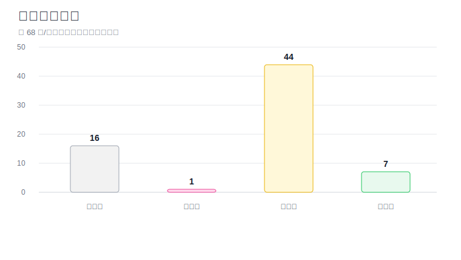

# 全部论文投稿状态

> **最后更新：** 2026-05-07

> 前端显示仅保留中文内容；期刊名称保持英文；GitHub 仓库链接不在前端表格显示。

---

## 颜色图例

<table width="100%">
<tr><td>&#9898;</td><td>待投稿</td></tr>
<tr><td>&#128992;</td><td>准备中</td></tr>
<tr><td>&#128308;</td><td>需处理</td></tr>
<tr><td>&#128150;</td><td>需修订</td></tr>
<tr><td>&#128993;</td><td>待初审</td></tr>
<tr><td>&#128309;</td><td>初审中</td></tr>
<tr><td>&#128994;</td><td>外审中</td></tr>
</table>

> **说明：** 表格已按状态分组排序，顺序为：待投稿 → 准备中 → 需处理 → 需修订 → 待初审 → 初审中 → 外审中；状态列用彩色圆点区分。已接收论文不再纳入本表统计。

## 状态统计

<table width="100%">
<tr>
<td valign="top" width="34%">
<table width="100%">
<tr><th>状态</th><th>数量</th></tr>
<tr bgcolor="#f2f2f2" style="background-color:#f2f2f2;"><td>&#9898; 待投稿</td><td>2</td></tr>
<tr bgcolor="#fff1db" style="background-color:#fff1db;"><td>&#128992; 准备中</td><td>3</td></tr>
<tr bgcolor="#ffe5e5" style="background-color:#ffe5e5;"><td>&#128308; 需处理</td><td>11</td></tr>
<tr bgcolor="#ffd9ec" style="background-color:#ffd9ec;"><td>&#128150; 需修订</td><td>1</td></tr>
<tr bgcolor="#fff8d9" style="background-color:#fff8d9;"><td>&#128993; 待初审</td><td>38</td></tr>
<tr bgcolor="#e8f1ff" style="background-color:#e8f1ff;"><td>&#128309; 初审中</td><td>6</td></tr>
<tr bgcolor="#e8f9ee" style="background-color:#e8f9ee;"><td>&#128994; 外审中</td><td>7</td></tr>
<tr><td><strong>合计</strong></td><td><strong>68</strong></td></tr>
</table>
</td>
<td valign="top" width="66%">

</td>
</tr>
</table>

[查看 Plotly 状态统计图](status_chart.html)

---

## 全部论文状态总表

<table class="paper-status-table" width="100%" style="width:100%; min-width:1160px;">

<colgroup>
<col width="12%">
<col width="43%">
<col width="45%">
</colgroup>

<thead>

<tr><th>状态</th><th>论文标题</th><th>投稿轨迹</th></tr>

</thead>

<tbody>

<tr bgcolor="#f2f2f2" style="background-color:#f2f2f2;">
<td bgcolor="#f2f2f2" style="background-color:#f2f2f2; vertical-align: top; white-space: nowrap;">&#9898; 待投稿</td>
<td bgcolor="#f2f2f2" style="background-color:#f2f2f2; vertical-align: top;">用于老年住宅活动分区功能分类的空间图神经网络</td>
<td bgcolor="#f2f2f2" style="background-color:#f2f2f2; vertical-align: top;">未投稿</td>
</tr>

<tr bgcolor="#f2f2f2" style="background-color:#f2f2f2;">
<td bgcolor="#f2f2f2" style="background-color:#f2f2f2; vertical-align: top; white-space: nowrap;">&#9898; 待投稿</td>
<td bgcolor="#f2f2f2" style="background-color:#f2f2f2; vertical-align: top;">基于线性调度法的适老改造模块制造多目标优化</td>
<td bgcolor="#f2f2f2" style="background-color:#f2f2f2; vertical-align: top;">未投稿</td>
</tr>

<tr bgcolor="#fff1db" style="background-color:#fff1db;">
<td bgcolor="#fff1db" style="background-color:#fff1db; vertical-align: top; white-space: nowrap;">&#128992; 准备中</td>
<td bgcolor="#fff1db" style="background-color:#fff1db; vertical-align: top;">AgeFriendlyDiff：基于条件扩散的适老住宅改造三维可视化</td>
<td bgcolor="#fff1db" style="background-color:#fff1db; vertical-align: top;">IEEE Access</td>
<!-- 后台情况说明：IEEE Access / Research Exchange 草稿仍在 additional information / 政策确认流程，尚未确认最终 Submit；用户已授权 APC、作者声明和 IEEE 政策确认按正常填写，最终投稿状态待复核。 -->
</tr>

<tr bgcolor="#fff1db" style="background-color:#fff1db;">
<td bgcolor="#fff1db" style="background-color:#fff1db; vertical-align: top; white-space: nowrap;">&#128992; 准备中</td>
<td bgcolor="#fff1db" style="background-color:#fff1db; vertical-align: top;">社区老年日间照料中心多模态热舒适的时空深度学习评估与预测</td>
<td bgcolor="#fff1db" style="background-color:#fff1db; vertical-align: top;">Energy</td>
<!-- 后台情况说明：#52 的 Energy 正确草稿/提交状态仍需复核；此前打开的 EGY-D-26-10556 对应另一篇贝叶斯元学习稿件，不能作为 #52 投稿完成记录。 -->
</tr>

<tr bgcolor="#ffe5e5" style="background-color:#ffe5e5;">
<td bgcolor="#ffe5e5" style="background-color:#ffe5e5; vertical-align: top; white-space: nowrap;">&#128308; 需处理</td>
<td bgcolor="#ffe5e5" style="background-color:#ffe5e5; vertical-align: top;">用于粮仓全年能源管理的双模式辐射制冷与太阳能供热屋面板系统</td>
<td bgcolor="#ffe5e5" style="background-color:#ffe5e5; vertical-align: top;">Energy and Buildings → Energy</td>
<!-- 后台情况说明：建议转投 -->
</tr>

<tr bgcolor="#ffe5e5" style="background-color:#ffe5e5;">
<td bgcolor="#ffe5e5" style="background-color:#ffe5e5; vertical-align: top; white-space: nowrap;">&#128308; 需处理</td>
<td bgcolor="#ffe5e5" style="background-color:#ffe5e5; vertical-align: top;">粮食储藏设施制冷系统的真实世界能效：来自中国河南的大规模实地研究</td>
<td bgcolor="#ffe5e5" style="background-color:#ffe5e5; vertical-align: top;">Journal of Cleaner Production</td>
<!-- 后台情况说明：已拒稿 -->
</tr>

<tr bgcolor="#ffe5e5" style="background-color:#ffe5e5;">
<td bgcolor="#ffe5e5" style="background-color:#ffe5e5; vertical-align: top; white-space: nowrap;">&#128308; 需处理</td>
<td bgcolor="#ffe5e5" style="background-color:#ffe5e5; vertical-align: top;">基于注意力机制与跨模态特征融合的痴呆早期检测多模态情绪分析</td>
<td bgcolor="#ffe5e5" style="background-color:#ffe5e5; vertical-align: top;">Computers in Biology and Medicine</td>
<!-- 后台情况说明：已拒稿 -->
</tr>

<tr bgcolor="#fff8d9" style="background-color:#fff8d9;">
<td bgcolor="#fff8d9" style="background-color:#fff8d9; vertical-align: top; white-space: nowrap;">&#128993; 待初审</td>
<td bgcolor="#fff8d9" style="background-color:#fff8d9; vertical-align: top;">面向居家适老环境评估的室内点云语义分割可迁移深度学习网络</td>
<td bgcolor="#fff8d9" style="background-color:#fff8d9; vertical-align: top;">Journal of Supercomputing（已投稿）</td>
<!-- 后台情况说明：2026-05-07 按已投稿状态更新；源码包已同步到 GitHub 提交 00cba5fffa77081394e455a251b2360e9554dbdc。 -->
</tr>

<tr bgcolor="#fff8d9" style="background-color:#fff8d9;">
<td bgcolor="#fff8d9" style="background-color:#fff8d9; vertical-align: top; white-space: nowrap;">&#128993; 待初审</td>
<td bgcolor="#fff8d9" style="background-color:#fff8d9; vertical-align: top;">面向居家适老环境评估的扩散模型点云合成</td>
<td bgcolor="#fff8d9" style="background-color:#fff8d9; vertical-align: top;">Journal of Supercomputing（已投稿）</td>
<!-- 后台情况说明：2026-05-07 按已投稿状态更新。 -->
</tr>

<tr bgcolor="#fff8d9" style="background-color:#fff8d9;">
<td bgcolor="#fff8d9" style="background-color:#fff8d9; vertical-align: top; white-space: nowrap;">&#128993; 待初审</td>
<td bgcolor="#fff8d9" style="background-color:#fff8d9; vertical-align: top;">老龄化夹缝：面向中国老旧居住社区低收入独居老人的智能安全韧性评估框架</td>
<td bgcolor="#fff8d9" style="background-color:#fff8d9; vertical-align: top;">Environment, Development and Sustainability（已投稿）</td>
<!-- 后台情况说明：2026-05-07 按已投稿状态更新。 -->
</tr>

<tr bgcolor="#fff8d9" style="background-color:#fff8d9;">
<td bgcolor="#fff8d9" style="background-color:#fff8d9; vertical-align: top; white-space: nowrap;">&#128993; 待初审</td>
<td bgcolor="#fff8d9" style="background-color:#fff8d9; vertical-align: top;">FRSGraph：面向老年居家环境的语义图 Transformer 跌倒风险空间预测</td>
<td bgcolor="#fff8d9" style="background-color:#fff8d9; vertical-align: top;">Journal of Supercomputing（已投稿）</td>
<!-- 后台情况说明：2026-05-07 按已投稿状态更新。 -->
</tr>

<tr bgcolor="#fff1db" style="background-color:#fff1db;">
<td bgcolor="#fff1db" style="background-color:#fff1db; vertical-align: top; white-space: nowrap;">&#128992; 投稿准备中</td>
<td bgcolor="#fff1db" style="background-color:#fff1db; vertical-align: top;">GridMamba-Risk：基于网格状态空间模型的整屋三维点云跌倒风险空间预测</td>
<td bgcolor="#fff1db" style="background-color:#fff1db; vertical-align: top;">Journal of Supercomputing（投稿准备中）</td>
<!-- 后台情况说明：Submission started (not yet completed). Source package prepared locally on 2026-05-07; portal upload is paused until the exact prepared package is synced to the corresponding GitHub repository. 已开始投稿准备（尚未最终提交）；2026-05-07 已生成本地源包，待同步到对应 GitHub 仓库后再上传。 -->
</tr>

<tr bgcolor="#fff8d9" style="background-color:#fff8d9;">
<td bgcolor="#fff8d9" style="background-color:#fff8d9; vertical-align: top; white-space: nowrap;">&#128993; 待初审</td>
<td bgcolor="#fff8d9" style="background-color:#fff8d9; vertical-align: top;">使用基于深度学习的情绪分析评估并优化老年照护政策实施：一项多源研究</td>
<td bgcolor="#fff8d9" style="background-color:#fff8d9; vertical-align: top;">Social Science &amp; Medicine（已投稿；SSM-S-26-05321）</td>
<!-- 后台情况说明：2026-05-07 按已投稿状态更新；Editorial Manager 稿件号 SSM-S-26-05321，LaTeX Source Files 已上传并生成审批 PDF。 -->
</tr>

<tr bgcolor="#ffe5e5" style="background-color:#ffe5e5;">
<td bgcolor="#ffe5e5" style="background-color:#ffe5e5; vertical-align: top; white-space: nowrap;">&#128308; 需处理</td>
<td bgcolor="#ffe5e5" style="background-color:#ffe5e5; vertical-align: top;">AccessGeometry：面向老年住宅无障碍合规评估的点云自动参数化建模</td>
<td bgcolor="#ffe5e5" style="background-color:#ffe5e5; vertical-align: top;">Frontiers of Architectural Research (FoAR)</td>
<!-- 后台情况说明：已拒稿 -->
</tr>

<tr bgcolor="#ffe5e5" style="background-color:#ffe5e5;">
<td bgcolor="#ffe5e5" style="background-color:#ffe5e5; vertical-align: top; white-space: nowrap;">&#128308; 需处理</td>
<td bgcolor="#ffe5e5" style="background-color:#ffe5e5; vertical-align: top;">AccessPath：面向老年居家环境自动无障碍评估的拓扑图式无障碍通行分析</td>
<td bgcolor="#ffe5e5" style="background-color:#ffe5e5; vertical-align: top;">IEEE Trans. Automation Science and Engineering</td>
<!-- 后台情况说明：退回草稿 -->
</tr>

<tr bgcolor="#fff8d9" style="background-color:#fff8d9;">
<td bgcolor="#fff8d9" style="background-color:#fff8d9; vertical-align: top; white-space: nowrap;">&#128993; 待初审</td>
<td bgcolor="#fff8d9" style="background-color:#fff8d9; vertical-align: top;">城市老年住宅空间热舒适的多模态感知与物理信息神经网络评估</td>
<td bgcolor="#fff8d9" style="background-color:#fff8d9; vertical-align: top;">Journal of Thermal Analysis and Calorimetry（已投稿）</td>
<!-- 后台情况说明：2026-05-07 按已投稿状态更新；JTAC 源包已同步到 GitHub 提交 b98df6405d90c89d921a4014cec036b47f7778bc。 -->
</tr>

<tr bgcolor="#ffe5e5" style="background-color:#ffe5e5;">
<td bgcolor="#ffe5e5" style="background-color:#ffe5e5; vertical-align: top; white-space: nowrap;">&#128308; 需处理</td>
<td bgcolor="#ffe5e5" style="background-color:#ffe5e5; vertical-align: top;">基于相变材料的多层粮仓自适应多温区温度控制</td>
<td bgcolor="#ffe5e5" style="background-color:#ffe5e5; vertical-align: top;">Applied Energy → Applied Thermal Engineering</td>
<!-- 后台情况说明：已拒稿 -->
</tr>

<tr bgcolor="#ffe5e5" style="background-color:#ffe5e5;">
<td bgcolor="#ffe5e5" style="background-color:#ffe5e5; vertical-align: top; white-space: nowrap;">&#128308; 需处理</td>
<td bgcolor="#ffe5e5" style="background-color:#ffe5e5; vertical-align: top;">基于多模态特征学习的依赖感知三维场景图生成：用于自动化居家适老环境评估</td>
<td bgcolor="#ffe5e5" style="background-color:#ffe5e5; vertical-align: top;">Automation in Construction</td>
<!-- 后台情况说明：已拒稿 -->
</tr>

<tr bgcolor="#ffe5e5" style="background-color:#ffe5e5;">
<td bgcolor="#ffe5e5" style="background-color:#ffe5e5; vertical-align: top; white-space: nowrap;">&#128308; 需处理</td>
<td bgcolor="#ffe5e5" style="background-color:#ffe5e5; vertical-align: top;">基于条件 GAN 与随机森林的多源数据融合社区韧性评估：来自中国河南的证据</td>
<td bgcolor="#ffe5e5" style="background-color:#ffe5e5; vertical-align: top;">Sustainable Cities and Society</td>
<!-- 后台情况说明：退回草稿 -->
</tr>

<tr bgcolor="#ffe5e5" style="background-color:#ffe5e5;">
<td bgcolor="#ffe5e5" style="background-color:#ffe5e5; vertical-align: top; white-space: nowrap;">&#128308; 需处理</td>
<td bgcolor="#ffe5e5" style="background-color:#ffe5e5; vertical-align: top;">老年游客对遗产建筑增强现实解说的接受度：扩展技术接受模型</td>
<td bgcolor="#ffe5e5" style="background-color:#ffe5e5; vertical-align: top;">Applied Sciences</td>
<!-- 后台情况说明：已拒稿 -->
</tr>

<tr bgcolor="#ffe5e5" style="background-color:#ffe5e5;">
<td bgcolor="#ffe5e5" style="background-color:#ffe5e5; vertical-align: top; white-space: nowrap;">&#128308; 需处理</td>
<td bgcolor="#ffe5e5" style="background-color:#ffe5e5; vertical-align: top;">历史社区智慧适老化改造策略的居民支持：整合地方依恋与技术接受</td>
<td bgcolor="#ffe5e5" style="background-color:#ffe5e5; vertical-align: top;">Buildings</td>
<!-- 后台情况说明：已拒稿 -->
</tr>

<tr bgcolor="#ffe5e5" style="background-color:#ffe5e5;">
<td bgcolor="#ffe5e5" style="background-color:#ffe5e5; vertical-align: top; white-space: nowrap;">&#128308; 需处理</td>
<td bgcolor="#ffe5e5" style="background-color:#ffe5e5; vertical-align: top;">AccessStairNet：面向老年居家环境无障碍评估的台阶与门槛深度学习检测</td>
<td bgcolor="#ffe5e5" style="background-color:#ffe5e5; vertical-align: top;">IEEE Transactions on Instrumentation and Measurement → IEEE Access</td>
<!-- 后台情况说明：已拒稿 -->
</tr>

<tr bgcolor="#ffd9ec" style="background-color:#ffd9ec;">
<td bgcolor="#ffd9ec" style="background-color:#ffd9ec; vertical-align: top; white-space: nowrap;">&#128150; 需修订</td>
<td bgcolor="#ffd9ec" style="background-color:#ffd9ec; vertical-align: top;">室内适老环境多维韧性评估框架：基于 Google Gemini Pro 的大模型指标构建</td>
<td bgcolor="#ffd9ec" style="background-color:#ffd9ec; vertical-align: top;">Humanities and Social Sciences Communications</td>
<!-- 后台情况说明：需修订 -->
</tr>

<tr bgcolor="#fff8d9" style="background-color:#fff8d9;">
<td bgcolor="#fff8d9" style="background-color:#fff8d9; vertical-align: top; white-space: nowrap;">&#128993; 待初审</td>
<td bgcolor="#fff8d9" style="background-color:#fff8d9; vertical-align: top;">适老建成环境专业人员对 AI-BIM 评估工具的接受度</td>
<td bgcolor="#fff8d9" style="background-color:#fff8d9; vertical-align: top;">Buildings</td>
<!-- 后台情况说明：MDPI SuSy 已最终提交；上传主稿包和 cover letter，元数据、作者角色、建议审稿人和 Statements 已完成。 -->
</tr>

<tr bgcolor="#fff8d9" style="background-color:#fff8d9;">
<td bgcolor="#fff8d9" style="background-color:#fff8d9; vertical-align: top; white-space: nowrap;">&#128993; 待初审</td>
<td bgcolor="#fff8d9" style="background-color:#fff8d9; vertical-align: top;">面向多层粮仓全年能源优化的双模式辐射制冷与太阳能供热</td>
<td bgcolor="#fff8d9" style="background-color:#fff8d9; vertical-align: top;">Energy and Buildings → Energy</td>
<!-- 后台情况说明：Energy / Editorial Manager 确认邮件已收到；正式稿号 EGY-D-26-10505；邮件说明稿件已被编辑部收到并 under review。作者审批 PDF 已核验 37 页，论文仓库 commit 38d9aa6。 -->
</tr>

<tr bgcolor="#fff8d9" style="background-color:#fff8d9;">
<td bgcolor="#fff8d9" style="background-color:#fff8d9; vertical-align: top; white-space: nowrap;">&#128993; 待初审</td>
<td bgcolor="#fff8d9" style="background-color:#fff8d9; vertical-align: top;">相变材料赋能的多层粮仓自适应多温区控制：实验与数值结合研究</td>
<td bgcolor="#fff8d9" style="background-color:#fff8d9; vertical-align: top;">Applied Energy → Applied Thermal Engineering → Physics of Fluids</td>
<!-- 后台情况说明：Physics of Fluids / PeerX 显示 Your manuscript has been submitted；稿件追踪号 POF26-AR-07216。 -->
</tr>

<tr bgcolor="#fff8d9" style="background-color:#fff8d9;">
<td bgcolor="#fff8d9" style="background-color:#fff8d9; vertical-align: top; white-space: nowrap;">&#128993; 待初审</td>
<td bgcolor="#fff8d9" style="background-color:#fff8d9; vertical-align: top;">面向多层粮仓围护结构的梯度纳米结构气凝胶复合保温材料</td>
<td bgcolor="#fff8d9" style="background-color:#fff8d9; vertical-align: top;">Construction and Building Materials → Journal of Materials Research and Technology-JMR&amp;T</td>
<!-- 后台情况说明：Elsevier 新投稿服务显示 Your manuscript has now been submitted；提交时间 03:24, May 6, 2026；已提交 cover_letter.pdf、declarationStatement.docx、manuscript.pdf。 -->
</tr>

<tr bgcolor="#fff8d9" style="background-color:#fff8d9;">
<td bgcolor="#fff8d9" style="background-color:#fff8d9; vertical-align: top; white-space: nowrap;">&#128993; 待初审</td>
<td bgcolor="#fff8d9" style="background-color:#fff8d9; vertical-align: top;">生成式 AI 驱动的适老室内改造可视化</td>
<td bgcolor="#fff8d9" style="background-color:#fff8d9; vertical-align: top;">Applied Sciences</td>
<!-- 后台情况说明：MDPI SuSy 显示 All steps completed，稿号 applsci-4331900；已上传 source ZIP 和 cover letter，完成题名、摘要、关键词、作者、建议审稿人、无利益冲突、基金和数据可用性填写。 -->
</tr>

<tr bgcolor="#fff8d9" style="background-color:#fff8d9;">
<td bgcolor="#fff8d9" style="background-color:#fff8d9; vertical-align: top; white-space: nowrap;">&#128993; 待初审</td>
<td bgcolor="#fff8d9" style="background-color:#fff8d9; vertical-align: top;">cGAN 辅助的适老住宅改造多目标优化</td>
<td bgcolor="#fff8d9" style="background-color:#fff8d9; vertical-align: top;">Buildings</td>
<!-- 后台情况说明：MDPI Buildings 仪表盘最新显示稿号 buildings-4331963，状态 Pending review，提交时间 2026-05-06 17:07:56；仪表盘标题为 cGAN-Assisted Age-Friendly Home Renovation Design: A Multi-Objective Optimization Framework Integrating Accessibility, Cost, and Spatial Efficiency。早前记录 buildings-4331653 需与邮件/门户历史进一步核对。 -->
</tr>

<tr bgcolor="#fff8d9" style="background-color:#fff8d9;">
<td bgcolor="#fff8d9" style="background-color:#fff8d9; vertical-align: top; white-space: nowrap;">&#128993; 待初审</td>
<td bgcolor="#fff8d9" style="background-color:#fff8d9; vertical-align: top;">元学习增强的少样本居家安全等级分类框架</td>
<td bgcolor="#fff8d9" style="background-color:#fff8d9; vertical-align: top;">IEEE Transactions on Instrumentation and Measurement</td>
<!-- 后台情况说明：IEEE TIM 系统显示 Manuscript Submitted，稿号 TIM-26-05228。 -->
</tr>

<tr bgcolor="#fff8d9" style="background-color:#fff8d9;">
<td bgcolor="#fff8d9" style="background-color:#fff8d9; vertical-align: top; white-space: nowrap;">&#128993; 待初审</td>
<td bgcolor="#fff8d9" style="background-color:#fff8d9; vertical-align: top;">适老住宅缺陷评估中的视觉语言模型综述</td>
<td bgcolor="#fff8d9" style="background-color:#fff8d9; vertical-align: top;">Electronics</td>
</tr>

<tr bgcolor="#fff8d9" style="background-color:#fff8d9;">
<td bgcolor="#fff8d9" style="background-color:#fff8d9; vertical-align: top; white-space: nowrap;">&#128993; 待初审</td>
<td bgcolor="#fff8d9" style="background-color:#fff8d9; vertical-align: top;">代码漏洞检测深度学习模型的系统评估：具有多种表示策略的模块化框架</td>
<td bgcolor="#fff8d9" style="background-color:#fff8d9; vertical-align: top;">International Journal of Information and Computer Security</td>
</tr>

<tr bgcolor="#fff8d9" style="background-color:#fff8d9;">
<td bgcolor="#fff8d9" style="background-color:#fff8d9; vertical-align: top; white-space: nowrap;">&#128993; 待初审</td>
<td bgcolor="#fff8d9" style="background-color:#fff8d9; vertical-align: top;">基于图神经网络与注意力机制的养老社区社会情感网络分析与孤独预防</td>
<td bgcolor="#fff8d9" style="background-color:#fff8d9; vertical-align: top;">IEEE Access → The Journal of Nutrition, Health and Aging (JNHA) → PLOS ONE</td>
</tr>

<tr bgcolor="#fff8d9" style="background-color:#fff8d9;">
<td bgcolor="#fff8d9" style="background-color:#fff8d9; vertical-align: top; white-space: nowrap;">&#128993; 待初审</td>
<td bgcolor="#fff8d9" style="background-color:#fff8d9; vertical-align: top;">中国 HIV 老年人适老居住环境因素因果模型：文本挖掘、模糊 DEMATEL 与区域比较</td>
<td bgcolor="#fff8d9" style="background-color:#fff8d9; vertical-align: top;">Journal of Urban Health → Frontiers in Public Health</td>
</tr>

<tr bgcolor="#fff8d9" style="background-color:#fff8d9;">
<td bgcolor="#fff8d9" style="background-color:#fff8d9; vertical-align: top; white-space: nowrap;">&#128993; 待初审</td>
<td bgcolor="#fff8d9" style="background-color:#fff8d9; vertical-align: top;">基于多模态特征学习的依赖感知三维场景图生成：用于自动化居家适老环境评估</td>
<td bgcolor="#fff8d9" style="background-color:#fff8d9; vertical-align: top;">Image and Vision Computing → IEEE Access</td>
</tr>

<tr bgcolor="#fff8d9" style="background-color:#fff8d9;">
<td bgcolor="#fff8d9" style="background-color:#fff8d9; vertical-align: top; white-space: nowrap;">&#128993; 待初审</td>
<td bgcolor="#fff8d9" style="background-color:#fff8d9; vertical-align: top;">老年用户对居家养老智能家居传感器系统的接受度：整合技术接受模型、隐私计算理论与空间自主性</td>
<td bgcolor="#fff8d9" style="background-color:#fff8d9; vertical-align: top;">BMC Psychology → PLOS ONE</td>
</tr>

<tr bgcolor="#fff8d9" style="background-color:#fff8d9;">
<td bgcolor="#fff8d9" style="background-color:#fff8d9; vertical-align: top; white-space: nowrap;">&#128993; 待初审</td>
<td bgcolor="#fff8d9" style="background-color:#fff8d9; vertical-align: top;">基于三维点云特征与 SHAP 可解释集成学习的老年住宅环境跌倒风险空间预测</td>
<td bgcolor="#fff8d9" style="background-color:#fff8d9; vertical-align: top;">Egyptian Informatics Journal</td>
</tr>

<tr bgcolor="#fff8d9" style="background-color:#fff8d9;">
<td bgcolor="#fff8d9" style="background-color:#fff8d9; vertical-align: top; white-space: nowrap;">&#128993; 待初审</td>
<td bgcolor="#fff8d9" style="background-color:#fff8d9; vertical-align: top;">适老住宅改造的混合现实与条件 GAN 集成框架：两阶段修复与 360 度全景可视化</td>
<td bgcolor="#fff8d9" style="background-color:#fff8d9; vertical-align: top;">Automation in Construction</td>
</tr>

<tr bgcolor="#fff8d9" style="background-color:#fff8d9;">
<td bgcolor="#fff8d9" style="background-color:#fff8d9; vertical-align: top; white-space: nowrap;">&#128993; 待初审</td>
<td bgcolor="#fff8d9" style="background-color:#fff8d9; vertical-align: top;">通过基于扩散的生成式设计提升适老住宅改造：面向安全与视觉舒适的双目标框架</td>
<td bgcolor="#fff8d9" style="background-color:#fff8d9; vertical-align: top;">Automation in Construction</td>
</tr>

<tr bgcolor="#fff8d9" style="background-color:#fff8d9;">
<td bgcolor="#fff8d9" style="background-color:#fff8d9; vertical-align: top; white-space: nowrap;">&#128993; 待初审</td>
<td bgcolor="#fff8d9" style="background-color:#fff8d9; vertical-align: top;">对比学习增强的 RGB-D 居家安全区域分割知识蒸馏</td>
<td bgcolor="#fff8d9" style="background-color:#fff8d9; vertical-align: top;">Sensors</td>
</tr>

<tr bgcolor="#fff8d9" style="background-color:#fff8d9;">
<td bgcolor="#fff8d9" style="background-color:#fff8d9; vertical-align: top; white-space: nowrap;">&#128993; 待初审</td>
<td bgcolor="#fff8d9" style="background-color:#fff8d9; vertical-align: top;">智慧养老系统中智能情绪监测与干预的双通道注意力机制</td>
<td bgcolor="#fff8d9" style="background-color:#fff8d9; vertical-align: top;">Biomedical Signal Processing and Control</td>
</tr>

<tr bgcolor="#fff8d9" style="background-color:#fff8d9;">
<td bgcolor="#fff8d9" style="background-color:#fff8d9; vertical-align: top; white-space: nowrap;">&#128993; 待初审</td>
<td bgcolor="#fff8d9" style="background-color:#fff8d9; vertical-align: top;">灵活半监督元学习少样本居家安全评估网络</td>
<td bgcolor="#fff8d9" style="background-color:#fff8d9; vertical-align: top;">Sensors</td>
</tr>

<tr bgcolor="#fff8d9" style="background-color:#fff8d9;">
<td bgcolor="#fff8d9" style="background-color:#fff8d9; vertical-align: top; white-space: nowrap;">&#128993; 待初审</td>
<td bgcolor="#fff8d9" style="background-color:#fff8d9; vertical-align: top;">VLM 驱动的适老住宅缺陷自动评估与报告生成</td>
<td bgcolor="#fff8d9" style="background-color:#fff8d9; vertical-align: top;">Sensors → Buildings</td>
<!-- 后台情况说明：Sensors 完成提交记录保留；2026-05-06 kingtou 检查/继续 Buildings 相关草稿时，MDPI 最终仪表盘显示的是 #45 cGAN 稿件 buildings-4331963 / Pending review，而不是本 VLM 稿题。故本稿不得标记为 Buildings 已投稿；若目标仍为 Buildings，需重新建立并核对正确草稿。 -->
</tr>

<tr bgcolor="#fff8d9" style="background-color:#fff8d9;">
<td bgcolor="#fff8d9" style="background-color:#fff8d9; vertical-align: top; white-space: nowrap;">&#128993; 待初审</td>
<td bgcolor="#fff8d9" style="background-color:#fff8d9; vertical-align: top;">住宅环境设计特征对老年人生理心理福祉影响的 VR 实验</td>
<td bgcolor="#fff8d9" style="background-color:#fff8d9; vertical-align: top;">PLOS ONE</td>
</tr>

<tr bgcolor="#fff8d9" style="background-color:#fff8d9;">
<td bgcolor="#fff8d9" style="background-color:#fff8d9; vertical-align: top; white-space: nowrap;">&#128993; 待初审</td>
<td bgcolor="#fff8d9" style="background-color:#fff8d9; vertical-align: top;">LLM 生成测试用例优化：AI 辅助软件测试中的质量缺陷表征与缓解</td>
<td bgcolor="#fff8d9" style="background-color:#fff8d9; vertical-align: top;">Software Testing, Verification and Reliability</td>
</tr>

<tr bgcolor="#fff8d9" style="background-color:#fff8d9;">
<td bgcolor="#fff8d9" style="background-color:#fff8d9; vertical-align: top; white-space: nowrap;">&#128993; 待初审</td>
<td bgcolor="#fff8d9" style="background-color:#fff8d9; vertical-align: top;">用于自动代码审查评论生成的上下文与结构特征融合混合 Transformer-MLP 模型</td>
<td bgcolor="#fff8d9" style="background-color:#fff8d9; vertical-align: top;">Software: Practice and Experience</td>
</tr>

<tr bgcolor="#fff8d9" style="background-color:#fff8d9;">
<td bgcolor="#fff8d9" style="background-color:#fff8d9; vertical-align: top; white-space: nowrap;">&#128993; 待初审</td>
<td bgcolor="#fff8d9" style="background-color:#fff8d9; vertical-align: top;">基于大语言模型苏格拉底式推理的可解释自动代码审查</td>
<td bgcolor="#fff8d9" style="background-color:#fff8d9; vertical-align: top;">Software: Practice and Experience</td>
</tr>

<tr bgcolor="#fff8d9" style="background-color:#fff8d9;">
<td bgcolor="#fff8d9" style="background-color:#fff8d9; vertical-align: top; white-space: nowrap;">&#128993; 待初审</td>
<td bgcolor="#fff8d9" style="background-color:#fff8d9; vertical-align: top;">DHA-BiGRU：用于自动代码审查评论分类的双注意力层次门控 BiGRU</td>
<td bgcolor="#fff8d9" style="background-color:#fff8d9; vertical-align: top;">Software Testing, Verification and Reliability</td>
</tr>

<tr bgcolor="#fff8d9" style="background-color:#fff8d9;">
<td bgcolor="#fff8d9" style="background-color:#fff8d9; vertical-align: top; white-space: nowrap;">&#128993; 待初审</td>
<td bgcolor="#fff8d9" style="background-color:#fff8d9; vertical-align: top;">从空间符号到社会实践：适老文化主题建筑空间意义建构的动态框架</td>
<td bgcolor="#fff8d9" style="background-color:#fff8d9; vertical-align: top;">Buildings</td>
</tr>

<tr bgcolor="#fff8d9" style="background-color:#fff8d9;">
<td bgcolor="#fff8d9" style="background-color:#fff8d9; vertical-align: top; white-space: nowrap;">&#128993; 待初审</td>
<td bgcolor="#fff8d9" style="background-color:#fff8d9; vertical-align: top;">遗产街区中老年人的意义建构与地方依恋：结构方程模型框架</td>
<td bgcolor="#fff8d9" style="background-color:#fff8d9; vertical-align: top;">Frontiers in Psychology</td>
</tr>

<tr bgcolor="#fff8d9" style="background-color:#fff8d9;">
<td bgcolor="#fff8d9" style="background-color:#fff8d9; vertical-align: top; white-space: nowrap;">&#128993; 待初审</td>
<td bgcolor="#fff8d9" style="background-color:#fff8d9; vertical-align: top;">面向文化主题公共建筑老年用户的空间意义感知量表开发：因子分析研究设计</td>
<td bgcolor="#fff8d9" style="background-color:#fff8d9; vertical-align: top;">Frontiers in Psychology</td>
</tr>

<tr bgcolor="#fff8d9" style="background-color:#fff8d9;">
<td bgcolor="#fff8d9" style="background-color:#fff8d9; vertical-align: top; white-space: nowrap;">&#128993; 待初审</td>
<td bgcolor="#fff8d9" style="background-color:#fff8d9; vertical-align: top;">养老照护中公众对使用 AI 的照护提供者的信任：基于能力、仁爱与诚信视角的概念综述</td>
<td bgcolor="#fff8d9" style="background-color:#fff8d9; vertical-align: top;">Universal Access in the Information Society</td>
</tr>

<tr bgcolor="#fff8d9" style="background-color:#fff8d9;">
<td bgcolor="#fff8d9" style="background-color:#fff8d9; vertical-align: top; white-space: nowrap;">&#128993; 待初审</td>
<td bgcolor="#fff8d9" style="background-color:#fff8d9; vertical-align: top;">后疫情时代中国适老社区韧性建设（由 JHPN 转投）</td>
<td bgcolor="#fff8d9" style="background-color:#fff8d9; vertical-align: top;">Journal of Health, Population and Nutrition → Archives of Public Health</td>
</tr>

<tr bgcolor="#fff8d9" style="background-color:#fff8d9;">
<td bgcolor="#fff8d9" style="background-color:#fff8d9; vertical-align: top; white-space: nowrap;">&#128993; 待初审</td>
<td bgcolor="#fff8d9" style="background-color:#fff8d9; vertical-align: top;">FRSPTNet：老年居家点云环境跌倒风险区域分割的多尺度超补丁 Transformer</td>
<td bgcolor="#fff8d9" style="background-color:#fff8d9; vertical-align: top;">IEEE TNSRE → IEEE Access</td>
</tr>

<tr bgcolor="#fff8d9" style="background-color:#fff8d9;">
<td bgcolor="#fff8d9" style="background-color:#fff8d9; vertical-align: top; white-space: nowrap;">&#128993; 待初审</td>
<td bgcolor="#fff8d9" style="background-color:#fff8d9; vertical-align: top;">健康老龄化评估的元学习框架：具有人群泛化能力的注意力神经过程</td>
<td bgcolor="#fff8d9" style="background-color:#fff8d9; vertical-align: top;">Neural Networks</td>
</tr>

<tr bgcolor="#e8f1ff" style="background-color:#e8f1ff;">
<td bgcolor="#e8f1ff" style="background-color:#e8f1ff; vertical-align: top; white-space: nowrap;">&#128309; 初审中</td>
<td bgcolor="#e8f1ff" style="background-color:#e8f1ff; vertical-align: top;">粮食储藏仓制冷系统真实世界能效评估：来自中国河南 65 个设施的证据</td>
<td bgcolor="#e8f1ff" style="background-color:#e8f1ff; vertical-align: top;">Journal of Cleaner Production → Energy → Scientific Reports</td>
<!-- 后台情况说明：Scientific Reports / SNAPP 显示 Submission received，进入 Technical Check；corrected main-tex-only ZIP 已上传，生成 review PDF 为 27 页且正文完整。 -->
</tr>

<tr bgcolor="#e8f1ff" style="background-color:#e8f1ff;">
<td bgcolor="#e8f1ff" style="background-color:#e8f1ff; vertical-align: top; white-space: nowrap;">&#128309; 初审中</td>
<td bgcolor="#e8f1ff" style="background-color:#e8f1ff; vertical-align: top;">中国老龄化背景下农村学校改造养老设施的公平导向服务就绪框架</td>
<td bgcolor="#e8f1ff" style="background-color:#e8f1ff; vertical-align: top;">International Journal for Equity in Health</td>
</tr>

<tr bgcolor="#e8f1ff" style="background-color:#e8f1ff;">
<td bgcolor="#e8f1ff" style="background-color:#e8f1ff; vertical-align: top; white-space: nowrap;">&#128309; 初审中</td>
<td bgcolor="#e8f1ff" style="background-color:#e8f1ff; vertical-align: top;">双层级注意力增强迁移学习用于居家适老环境评估中的点云语义分割</td>
<td bgcolor="#e8f1ff" style="background-color:#e8f1ff; vertical-align: top;">Journal of Big Data</td>
</tr>

<tr bgcolor="#e8f1ff" style="background-color:#e8f1ff;">
<td bgcolor="#e8f1ff" style="background-color:#e8f1ff; vertical-align: top; white-space: nowrap;">&#128309; 初审中</td>
<td bgcolor="#e8f1ff" style="background-color:#e8f1ff; vertical-align: top;">基于三维点云语义分析的适老住宅合规自动评估</td>
<td bgcolor="#e8f1ff" style="background-color:#e8f1ff; vertical-align: top;">Virtual Reality</td>
</tr>

<tr bgcolor="#e8f1ff" style="background-color:#e8f1ff;">
<td bgcolor="#e8f1ff" style="background-color:#e8f1ff; vertical-align: top; white-space: nowrap;">&#128309; 初审中</td>
<td bgcolor="#e8f1ff" style="background-color:#e8f1ff; vertical-align: top;">面向适老韧性评估的 BIM 集成空间世界模型：概念框架与研究议程</td>
<td bgcolor="#e8f1ff" style="background-color:#e8f1ff; vertical-align: top;">Humanities and Social Sciences Communications</td>
</tr>

<tr bgcolor="#e8f1ff" style="background-color:#e8f1ff;">
<td bgcolor="#e8f1ff" style="background-color:#e8f1ff; vertical-align: top; white-space: nowrap;">&#128309; 初审中</td>
<td bgcolor="#e8f1ff" style="background-color:#e8f1ff; vertical-align: top;">被遗忘之外：中国农村独居老人的低成本智能安全韧性框架</td>
<td bgcolor="#e8f1ff" style="background-color:#e8f1ff; vertical-align: top;">BMC Geriatrics</td>
</tr>

<tr bgcolor="#e8f9ee" style="background-color:#e8f9ee;">
<td bgcolor="#e8f9ee" style="background-color:#e8f9ee; vertical-align: top; white-space: nowrap;">&#128994; 外审中</td>
<td bgcolor="#e8f9ee" style="background-color:#e8f9ee; vertical-align: top;">适老社区时序评估的贝叶斯元学习框架</td>
<td bgcolor="#e8f9ee" style="background-color:#e8f9ee; vertical-align: top;">BMC Medical Research Methodology</td>
</tr>

<tr bgcolor="#e8f9ee" style="background-color:#e8f9ee;">
<td bgcolor="#e8f9ee" style="background-color:#e8f9ee; vertical-align: top; white-space: nowrap;">&#128994; 外审中</td>
<td bgcolor="#e8f9ee" style="background-color:#e8f9ee; vertical-align: top;">中国老年 HIV 感染者适老居住环境评估的个体中心框架</td>
<td bgcolor="#e8f9ee" style="background-color:#e8f9ee; vertical-align: top;">BMC Geriatrics</td>
</tr>

<tr bgcolor="#e8f9ee" style="background-color:#e8f9ee;">
<td bgcolor="#e8f9ee" style="background-color:#e8f9ee; vertical-align: top; white-space: nowrap;">&#128994; 外审中</td>
<td bgcolor="#e8f9ee" style="background-color:#e8f9ee; vertical-align: top;">AFLE-HIV：中国老年 HIV 感染者适老居住环境评估框架构建</td>
<td bgcolor="#e8f9ee" style="background-color:#e8f9ee; vertical-align: top;">BMC Public Health</td>
</tr>

<tr bgcolor="#e8f9ee" style="background-color:#e8f9ee;">
<td bgcolor="#e8f9ee" style="background-color:#e8f9ee; vertical-align: top; white-space: nowrap;">&#128994; 外审中</td>
<td bgcolor="#e8f9ee" style="background-color:#e8f9ee; vertical-align: top;">面向老年人的15分钟城市：健康与适老城市化的操作框架</td>
<td bgcolor="#e8f9ee" style="background-color:#e8f9ee; vertical-align: top;">Scientific Reports</td>
</tr>

<tr bgcolor="#e8f9ee" style="background-color:#e8f9ee;">
<td bgcolor="#e8f9ee" style="background-color:#e8f9ee; vertical-align: top; white-space: nowrap;">&#128994; 外审中</td>
<td bgcolor="#e8f9ee" style="background-color:#e8f9ee; vertical-align: top;">后疫情时代中国适老社区韧性建设：循证多准则评估框架</td>
<td bgcolor="#e8f9ee" style="background-color:#e8f9ee; vertical-align: top;">Journal of Health, Population and Nutrition</td>
</tr>

<tr bgcolor="#e8f9ee" style="background-color:#e8f9ee;">
<td bgcolor="#e8f9ee" style="background-color:#e8f9ee; vertical-align: top; white-space: nowrap;">&#128994; 外审中</td>
<td bgcolor="#e8f9ee" style="background-color:#e8f9ee; vertical-align: top;">香港高层社区老年居民火灾韧性的循证评估框架</td>
<td bgcolor="#e8f9ee" style="background-color:#e8f9ee; vertical-align: top;">Humanities and Social Sciences Communications</td>
</tr>

<tr bgcolor="#e8f9ee" style="background-color:#e8f9ee;">
<td bgcolor="#e8f9ee" style="background-color:#e8f9ee; vertical-align: top; white-space: nowrap;">&#128994; 外审中</td>
<td bgcolor="#e8f9ee" style="background-color:#e8f9ee; vertical-align: top;">挖掘马来西亚商业建筑能源灵活性的基于 LSTM 的模型预测控制方法</td>
<td bgcolor="#e8f9ee" style="background-color:#e8f9ee; vertical-align: top;">Scientific Reports</td>
</tr>

</tbody>

</table>

