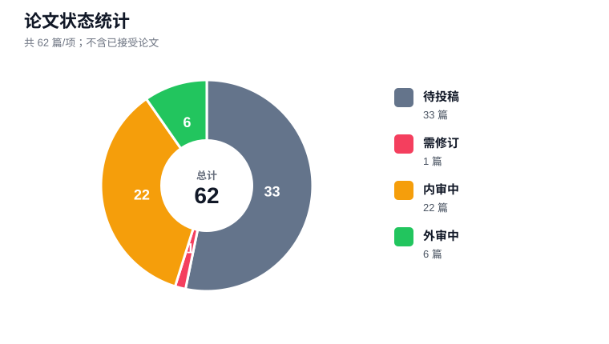

# 全部论文投稿状态

> **最后更新：** 2026-08-18

> 前端显示仅保留中文内容；期刊名称保持英文；GitHub 仓库链接不在前端表格显示。

---

## 颜色图例

<table width="100%">
<tr><td>&#9898;</td><td>待投稿</td></tr>
<tr><td>&#128150;</td><td>需修订</td></tr>
<tr><td>&#128993;</td><td>内审中</td></tr>
<tr><td>&#128994;</td><td>外审中</td></tr>
</table>

> **质量风险标识：** `⚠ 低质量高风险` 使用独立红色标识，表示编辑决定或版本审计显示存在严重原创性或文本重叠风险；该标识不计入投稿状态统计。

## 状态统计

<table width="100%">
<tr>
<td valign="top" width="34%">
<table width="100%">
<tr><th>状态</th><th>数量</th></tr>
<tr bgcolor="#f2f2f2" style="background-color:#f2f2f2;"><td>&#9898; 待投稿</td><td>31</td></tr>
<tr bgcolor="#ffd9ec" style="background-color:#ffd9ec;"><td>&#128150; 需修订</td><td>0</td></tr>
<tr bgcolor="#fff8d9" style="background-color:#fff8d9;"><td>&#128993; 内审中</td><td>24</td></tr>
<tr bgcolor="#e8f9ee" style="background-color:#e8f9ee;"><td>&#128994; 外审中</td><td>7</td></tr>
<tr><td><strong>合计</strong></td><td><strong>62</strong></td></tr>
</table>
</td>
<td valign="top" width="66%">

</td>
</tr>
</table>

[打开网页状态面板](index.html)

[查看 Plotly 状态统计图](status_chart.html)

---

## 全部论文状态总表

<table class="paper-status-table" width="100%" style="width:100%; min-width:1480px;">

<colgroup>
<col width="6%">
<col width="39%">
<col width="35%">
<col width="20%">
</colgroup>

<thead>

<tr><th>状态</th><th>论文标题</th><th>Journal Track</th><th>投稿系统信息</th></tr>

</thead>

<tbody>
<tr bgcolor="#f2f2f2" style="background-color:#f2f2f2;">
<td bgcolor="#f2f2f2" style="background-color:#f2f2f2; vertical-align: top; white-space: nowrap;">&#9898;</td>
<td bgcolor="#f2f2f2" style="background-color:#f2f2f2; vertical-align: top;">AccessPath：面向老年居家环境自动无障碍评估的拓扑图式无障碍通行分析</td>
<td bgcolor="#f2f2f2" style="background-color:#f2f2f2; vertical-align: top;">Disability and Rehabilitation (Rejected: TIDS-05-2026-088)</td><td bgcolor="#f2f2f2" style="background-color:#f2f2f2; vertical-align: top;">&nbsp;</td>
</tr>

<tr bgcolor="#f2f2f2" style="background-color:#f2f2f2;">
<td bgcolor="#f2f2f2" style="background-color:#f2f2f2; vertical-align: top; white-space: nowrap;">&#9898;</td>
<td bgcolor="#f2f2f2" style="background-color:#f2f2f2; vertical-align: top;">面向多层粮仓围护结构的梯度纳米结构气凝胶复合保温材料</td>
<td bgcolor="#f2f2f2" style="background-color:#f2f2f2; vertical-align: top;">Construction and Building Materials (Rejected: CONBUILDMAT-D-26-04279) → Journal of Materials Research and Technology-JMR&amp;T (Rejected: JMRT-D-26-03652)</td><td bgcolor="#f2f2f2" style="background-color:#f2f2f2; vertical-align: top;">&nbsp;</td>
</tr>

<tr bgcolor="#f2f2f2" style="background-color:#f2f2f2;">
<td bgcolor="#f2f2f2" style="background-color:#f2f2f2; vertical-align: top; white-space: nowrap;">&#9898;</td>
<td bgcolor="#f2f2f2" style="background-color:#f2f2f2; vertical-align: top;">基于线性调度法的适老改造模块制造多目标优化</td>
<td bgcolor="#f2f2f2" style="background-color:#f2f2f2; vertical-align: top;">Computers &amp; Industrial Engineering (Rejected: CAIE-D-26-03890)</td><td bgcolor="#f2f2f2" style="background-color:#f2f2f2; vertical-align: top;">Elsevier New Submission Service / Editorial Manager / Computers &amp; Industrial Engineering；稿号：CAIE-D-26-03890；confirmation/draft UUID：1e59a908-49fa-4bc6-a70b-49f62fda4fad；确认时间：2026-05-30 11:34 Asia/Shanghai；拒稿时间：2026-06-03 01:43 Asia/Shanghai；拒稿原因：unacceptable level of overlap with prior publications，originality cannot be assessed；证据：Gmail All Mail messageId 19e896f09c0ad755，同文 Gmail Spam 未读副本 messageId 19e896f361a571b8；2026-06-03 01:55 的 Elsevier transfer recommendation 不视为有效新投稿；未存储密码。</td>
</tr>

<tr bgcolor="#f2f2f2" style="background-color:#f2f2f2;">
<td bgcolor="#f2f2f2" style="background-color:#f2f2f2; vertical-align: top; white-space: nowrap;">&#9898;</td>
<td bgcolor="#f2f2f2" style="background-color:#f2f2f2; vertical-align: top;">生成式 AI 驱动的适老室内改造可视化</td>
<td bgcolor="#f2f2f2" style="background-color:#f2f2f2; vertical-align: top;">Applied Sciences (Rejected: applsci-4331900) → Journal of Building Engineering (Rejected: JBE-D-26-09312)</td><td bgcolor="#f2f2f2" style="background-color:#f2f2f2; vertical-align: top;">Elsevier New Submission Service / Editorial Manager / Journal of Building Engineering；稿号：JBE-D-26-09312；confirmation/draft UUID：48e3354b-6f07-4e29-b09b-19b31c6b1596；确认时间：2026-05-29 22:45 Asia/Shanghai（Gmail Spam）；拒稿时间：2026-06-01 08:38 Asia/Shanghai（Gmail Spam, messageId 19e809e84d143d3b）；拒稿原因：未达到期刊所需质量标准，缺乏 sufficient/scientific novelty；此前 Applied Sciences applsci-4331900 已 Declined；未存储密码。</td>
</tr>

<tr bgcolor="#f2f2f2" style="background-color:#f2f2f2;">
<td bgcolor="#f2f2f2" style="background-color:#f2f2f2; vertical-align: top; white-space: nowrap;">&#9898;</td>
<td bgcolor="#f2f2f2" style="background-color:#f2f2f2; vertical-align: top;">基于条件 GAN 与随机森林的多源数据融合社区韧性评估：来自中国河南的证据</td>
<td bgcolor="#f2f2f2" style="background-color:#f2f2f2; vertical-align: top;">Sustainable Cities and Society (Sent back: SCSI-D-26-02059) → International Journal of Disaster Risk Reduction (Rejected: IJDRR-D-26-01585) → Frontiers in Environmental Science (Rejected: 1901998) → Environmental Monitoring and Assessment (Preparation complete; portal not yet opened)</td><td bgcolor="#f2f2f2" style="background-color:#f2f2f2; vertical-align: top;">Springer Nature SNAPP / Environmental Monitoring and Assessment；2026-06-18 本地转投包已固定并推送，commit 1cd4ad58a3f83e45b8c259734fb309800b6485f9；LaTeX source ZIP `paper3_emas_source_20260618.zip` 已生成，包含 manuscript.tex、manuscript.bbl、references.bib、sn-jnl.cls、sn-mathphys-num.bst 和图件；尚未进入门户上传。</td>
</tr>

<tr bgcolor="#f2f2f2" style="background-color:#f2f2f2;">
<td bgcolor="#f2f2f2" style="background-color:#f2f2f2; vertical-align: top; white-space: nowrap;">&#9898;</td>
<td bgcolor="#f2f2f2" style="background-color:#f2f2f2; vertical-align: top;">AgeFriendlyDiff：基于条件扩散的适老住宅改造三维可视化</td>
<td bgcolor="#f2f2f2" style="background-color:#f2f2f2; vertical-align: top;">Multimedia Tools and Applications (Rejected / withdrawal requested: MTAP-D-26-02294) → Pattern Recognition (Rejected: PR-D-26-07070)</td><td bgcolor="#f2f2f2" style="background-color:#f2f2f2; vertical-align: top;">Editorial Manager / Pattern Recognition；稿号 PR-D-26-07070；2026-06-04 06:10 Asia/Shanghai 收到 Decision on your Submission（Gmail messageId 19e8f89e2586519d），编辑认为稿件不适合 Pattern Recognition，建议可考虑 resubmission；按稿号和英文题名复核 Gmail in:anywhere / in:spam、wenallpapersstatus、本地论文仓库，未发现之后有效新投稿确认；当前回到待投稿。投稿系统历史信息：用户名 wenquan0817；显示名 quan WEN；投稿系统注册邮箱 wenquan@student.usm.my；ORCID 已绑定 0009-0005-3975-8104；未存储密码。</td>
</tr>

<tr bgcolor="#f2f2f2" style="background-color:#f2f2f2;">
<td bgcolor="#f2f2f2" style="background-color:#f2f2f2; vertical-align: top; white-space: nowrap;">&#9898;</td>
<td bgcolor="#f2f2f2" style="background-color:#f2f2f2; vertical-align: top;">cGAN 辅助的适老住宅改造多目标优化</td>
<td bgcolor="#f2f2f2" style="background-color:#f2f2f2; vertical-align: top;">Buildings (Rejected: buildings-4331653) → Energy and Buildings (Rejected: ENB-D-26-04088) → Buildings (Declined: buildings-4392896) → Sustainability (Declined: sustainability-4415396)</td><td bgcolor="#f2f2f2" style="background-color:#f2f2f2; vertical-align: top;">MDPI SuSy / Sustainability；Manuscript ID：sustainability-4415396；2026-06-18 15:59 Asia/Shanghai 收到 “[Sustainability] Manuscript ID: sustainability-4415396 - Submission Received” 正式确认邮件；2026-06-22 14:09 Asia/Shanghai 收到 “[Sustainability] Manuscript ID: sustainability-4415396 - Declined for Publication”（Gmail messageId 19eedf30dd4043a2），编辑部说明将不再处理该稿，筛选依据包括 discipline、novelty and general significance；题名：cGAN-Supported Multi-Objective Planning for Age-Friendly Home Renovation；投稿系统账号/显示名：Peng Chao；注册邮箱：hngmpengchao@gmail.com；投稿系统作者：Peng Chao *；按稿号和英文题名搜索 Gmail in:anywhere / in:spam、wenallpapersstatus 与 paper-45 仓库，未发现 2026-06-22 之后有效新投稿确认；当前回到待投稿。上传包：mdpi_sustainability_latex_source_20260618.zip；SHA256：5578973E92C4FAE5D75F332E6C8E81E6C9427CBAB38EEC001F2209B242BD0C91；论文仓库提交：3f1b6920a1cbd6648203f3afab47118416dea9b3；Funding：Henan Provincial Federation of Social Sciences / SKL2022608；未存储密码。</td>
</tr>

<tr bgcolor="#f2f2f2" style="background-color:#f2f2f2;">
<td bgcolor="#f2f2f2" style="background-color:#f2f2f2; vertical-align: top; white-space: nowrap;">&#9898;</td>
<td bgcolor="#f2f2f2" style="background-color:#f2f2f2; vertical-align: top;">城市老年住宅空间热舒适的多模态感知与物理信息神经网络评估</td>
<td bgcolor="#f2f2f2" style="background-color:#f2f2f2; vertical-align: top;">Environmental Health (Rejected: 579316cb-d2eb-4722-b414-e73837087196) → Environmental Monitoring and Assessment (Rejected: a27a5499-04c1-4e02-a2ea-ae736dc4e58e) → Journal of Thermal Analysis and Calorimetry (Rejected: fa0928ba-ab5f-4b72-9bec-6cbb7fade993)</td><td bgcolor="#f2f2f2" style="background-color:#f2f2f2; vertical-align: top;">Springer Nature SNAPP / Journal of Thermal Analysis and Calorimetry；Submission ID：fa0928ba-ab5f-4b72-9bec-6cbb7fade993；RSID：rs-9638603；2026-06-18 05:13 Asia/Shanghai 在 Gmail Spam 收到 “Decision on your submission to Journal of Thermal Analysis and Calorimetry”（messageId 19ed76eea5bbfbd2），决定拒稿；编辑意见为稿件未聚焦 thermal analysis / thermo-analytical novel finding，scope not in line with the journal。2026-06-18 journal recommendations 与 2026-06-19 Research Square update 只属于转投/跟踪信息，不是有效新投稿。按 Submission ID 和英文题名搜索 Gmail in:anywhere / in:spam、wenallpapersstatus 与 paper-51-canonical，未发现 2026-06-18 之后有效新投稿确认；当前回到待投稿。未存储密码。</td>
</tr>

<tr bgcolor="#f2f2f2" style="background-color:#f2f2f2;">
<td bgcolor="#f2f2f2" style="background-color:#f2f2f2; vertical-align: top; white-space: nowrap;">&#9898;</td>
<td bgcolor="#f2f2f2" style="background-color:#f2f2f2; vertical-align: top;">老年用户对居家养老智能家居传感器系统的接受度：整合技术接受模型、隐私计算理论与空间自主性</td>
<td bgcolor="#f2f2f2" style="background-color:#f2f2f2; vertical-align: top;">BMC Psychology → PLOS ONE (Withdrawn: PONE-D-26-22334)</td><td bgcolor="#f2f2f2" style="background-color:#f2f2f2; vertical-align: top;">Editorial Manager / PLOS ONE；稿号：PONE-D-26-22334；2026-06-15 16:56:35 Asia/Shanghai PLOS ONE 再次发出 edits requested / reminder（Gmail messageId 19eca7f3b820c2a3），要求上传 original ethics approval document 并继续原 submission；2026-06-29 09:53:33 Asia/Shanghai PDF built 邮件（Gmail messageId 19f1114f50ef4db6）只要求 approve PDF to complete submission，不能视为完成提交；2026-06-29 09:55:48 Asia/Shanghai PLOS ONE 通知 PONE-D-26-22334 已 withdrawn from review process（Gmail messageId 19f1117053d33f4b）。当前无有效在投记录，按待投稿处理。未存储密码。</td>
</tr>

<tr bgcolor="#f2f2f2" style="background-color:#f2f2f2;">
<td bgcolor="#f2f2f2" style="background-color:#f2f2f2; vertical-align: top; white-space: nowrap;">&#9898;</td>
<td bgcolor="#f2f2f2" style="background-color:#f2f2f2; vertical-align: top;">用于老年住宅活动分区功能分类的空间图神经网络</td>
<td bgcolor="#f2f2f2" style="background-color:#f2f2f2; vertical-align: top;">Neurocomputing (Rejected: NEUCOM-D-26-11293)</td><td bgcolor="#f2f2f2" style="background-color:#f2f2f2; vertical-align: top;">Elsevier New Submission Service / Editorial Manager / Neurocomputing；稿号：NEUCOM-D-26-11293；confirmation/draft UUID：56c4c50d-d731-44ff-b861-2329b22a5261；2026-05-29 22:47 Asia/Shanghai 投稿确认邮件位于 Gmail Spam（messageId 19e7434b0a837405）；2026-06-27 19:06:34 Asia/Shanghai 收到 Neurocomputing 拒稿邮件，位于 Gmail Spam（messageId 19f08c2ce33f435b），编辑认为稿件不适合该刊 readership，作者意见为 lack of sufficient novelty；未发现此后有效新投稿确认。未存储密码。</td>
</tr>

<tr bgcolor="#f2f2f2" style="background-color:#f2f2f2;">
<td bgcolor="#f2f2f2" style="background-color:#f2f2f2; vertical-align: top; white-space: nowrap;">&#9898;</td>
<td bgcolor="#f2f2f2" style="background-color:#f2f2f2; vertical-align: top;">面向老年人的15分钟城市：健康与适老城市化的操作框架</td>
<td bgcolor="#f2f2f2" style="background-color:#f2f2f2; vertical-align: top;">Scientific Reports (Rejected: 18f592ab-282a-47fb-91c9-3bd372a0da53)</td><td bgcolor="#f2f2f2" style="background-color:#f2f2f2; vertical-align: top;">Springer Nature / Scientific Reports；Submission ID：18f592ab-282a-47fb-91c9-3bd372a0da53；2026-06-23 21:38:42 Asia/Shanghai 收到 Scientific Reports 拒稿决定（Gmail messageId 19ef4b47b69a9f68），编辑认为数据限制使结论无法充分成立，并指出 scientific rigour / validity concerns；2026-06-24 21:27:42 Asia/Shanghai Research Square 通知该稿 no longer undergoing peer review at Scientific Reports（Gmail messageId 19ef9d0c7f5b11c9，RSID rs-8878196）。未发现此后有效新投稿确认；当前待投稿。未存储密码。</td>
</tr>

<tr bgcolor="#f2f2f2" style="background-color:#f2f2f2;">
<td bgcolor="#f2f2f2" style="background-color:#f2f2f2; vertical-align: top; white-space: nowrap;">&#9898;</td>
<td bgcolor="#f2f2f2" style="background-color:#f2f2f2; vertical-align: top;">适老建成环境专业人员对 AI-BIM 评估工具的接受度</td>
<td bgcolor="#f2f2f2" style="background-color:#f2f2f2; vertical-align: top;">Buildings (Rejected: buildings-4330016) → Cities (Rejected: JCIT-D-26-03897)</td><td bgcolor="#f2f2f2" style="background-color:#f2f2f2; vertical-align: top;">Elsevier Editorial Manager / Cities；稿号：JCIT-D-26-03897；2026-07-19 21:58:29 Asia/Shanghai 收到 Decision on submission to Cities（Gmail Spam，messageId 19f7aac180c47b41）；拒稿原因：lack of sufficient novelty，未送外审；2026-07-19 transfer recommendation 不视为有效新投稿；未发现之后 submission received / manuscript submitted 证据；未存储密码。</td>
</tr>

<tr bgcolor="#f2f2f2" style="background-color:#f2f2f2;">
<td bgcolor="#f2f2f2" style="background-color:#f2f2f2; vertical-align: top; white-space: nowrap;">&#9898;</td>
<td bgcolor="#f2f2f2" style="background-color:#f2f2f2; vertical-align: top;">基于注意力机制与跨模态特征融合的痴呆早期检测多模态情绪分析</td>
<td bgcolor="#f2f2f2" style="background-color:#f2f2f2; vertical-align: top;">Computers in Biology and Medicine (Rejected: CIBM-D-26-00934) → Biomedical Signal Processing and Control (Rejected: BSPC-D-26-07670) → Frontiers in Neurology (Rejected: 1901990) → Frontiers in Aging Neuroscience (Rejected: 1852729; user confirmation 2026-08-10)</td><td bgcolor="#f2f2f2" style="background-color:#f2f2f2; vertical-align: top;">Frontiers submission portal / My Frontiers；Frontiers in Neurology 稿号 1901990 于 2026-06-08 20:26 Asia/Shanghai 收到 cannot be accepted 决定（Gmail messageId 19ea732c9f55b293）；同题稿 Frontiers in Aging Neuroscience 稿号 1852729 于 2026-06-08 20:31 Asia/Shanghai 收到 source data/code/original images/ethics approval 原件及英文译文请求，截止 2026-06-24（Gmail messageId 19ea737369baf8cb）。2026-08-10 03:42:40 +08:00 用户明确指示：目前在投且论文作者为 Peng Chao 的稿件一律按被拒稿处理；该指示作为 1852729 的当前状态证据，正式决定邮件时间与拒稿原因未提供。投稿系统账号 Peng Chao / hngmpengchao@gmail.com；未存储密码。</td>
</tr>

<tr bgcolor="#f2f2f2" style="background-color:#f2f2f2;">
<td bgcolor="#f2f2f2" style="background-color:#f2f2f2; vertical-align: top; white-space: nowrap;">&#9898;</td>
<td bgcolor="#f2f2f2" style="background-color:#f2f2f2; vertical-align: top;">适老社区时序评估的贝叶斯元学习框架</td>
<td bgcolor="#f2f2f2" style="background-color:#f2f2f2; vertical-align: top;">BMC Medical Research Methodology (Rejected: f905dc2b-94cd-47e6-b4a4-4423c0a16ec8) → Energy (Rejected: EGY-D-26-10556) → Neurocomputing (Rejected: NEUCOM-D-26-11307) → Big Data Research (Rejected: BDR-D-26-00946)</td><td bgcolor="#f2f2f2" style="background-color:#f2f2f2; vertical-align: top;">Elsevier Editorial Manager / Big Data Research；稿号：BDR-D-26-00946；来源为 Neurocomputing article transfer，原稿号 NEUCOM-D-26-11307；2026-06-29 BDR Author Dashboard 显示 With Editor。2026-07-29 14:53 Asia/Shanghai 收到 Decision on submission to Big Data Research：编辑初筛拒稿，主要原因是仅使用 30 个社区的数据，未证明大数据场景的可扩展性、效率或鲁棒性，并且缺少面向大数据平台、架构或处理技术的实质性工程/系统贡献。2026-08-01 transfer recommendation 仅为转投提醒，不视为有效新投稿。投稿系统用户名 QWen-782，页面显示名 Quan Wen，注册邮箱 wenquan@student.usm.my；ORCID 字段未显示 / 未确认绑定；投稿系统作者（以 portal 为准）：Quan Wen；Dr. Mazran Ismail；Yanting Wu；Dr. Muhammad Hafeez Abdul Nasir；未存储密码。</td>
</tr>

<tr bgcolor="#f2f2f2" style="background-color:#f2f2f2;">
<td bgcolor="#f2f2f2" style="background-color:#f2f2f2; vertical-align: top; white-space: nowrap;">&#9898;</td>
<td bgcolor="#f2f2f2" style="background-color:#f2f2f2; vertical-align: top;">灵活半监督元学习少样本居家安全评估网络</td>
<td bgcolor="#f2f2f2" style="background-color:#f2f2f2; vertical-align: top;">Sensors (Rejected: sensors-4282374) → IEEE Access (Rejected: Access-2026-26733; user confirmation 2026-08-10)</td><td bgcolor="#f2f2f2" style="background-color:#f2f2f2; vertical-align: top;">IEEE Author Portal / IEEE Access / Research Exchange (Atypon ReX)；稿号：Access-2026-26733；2026-08-10 03:42:40 +08:00 用户明确指示：目前在投且论文作者为 Peng Chao 的稿件一律按被拒稿处理；该指示作为 Access-2026-26733 的当前状态证据，正式决定邮件时间与拒稿原因未提供。投稿系统用户名/显示名：Peng Chao；注册邮箱：wenquan632@gmail.com；ORCID：已绑定（系统显示 My ORCID iD 菜单项）；投稿系统作者（与 LaTeX 一致）：Peng Chao；未存储密码。</td>
</tr>

<tr bgcolor="#f2f2f2" style="background-color:#f2f2f2;">
<td bgcolor="#f2f2f2" style="background-color:#f2f2f2; vertical-align: top; white-space: nowrap;">&#9898;</td>
<td bgcolor="#f2f2f2" style="background-color:#f2f2f2; vertical-align: top;">基于三维点云语义分析的适老住宅合规自动评估</td>
<td bgcolor="#f2f2f2" style="background-color:#f2f2f2; vertical-align: top;">Sensors (Rejected: sensors-4281712) → Virtual Reality (Rejected: c2567b16-7061-4976-a20e-849247d4a33b; 2026-07-28 02:32:27 Asia/Shanghai)</td><td bgcolor="#f2f2f2" style="background-color:#f2f2f2; vertical-align: top;">Springer Nature / Virtual Reality；Submission ID：c2567b16-7061-4976-a20e-849247d4a33b；2026-07-28 02:32:27 Asia/Shanghai 收到正式拒稿决定（Gmail Spam，messageId 19fa4d9d137a0343）。Editor-in-Chief 指出 41% 内容疑似复制自 https://www.sciencedirect.com/science/article/abs/pii/S092658052400339X?via%3Dihub，因此在送审前拒稿。按 Submission ID 与英文题名搜索 Gmail in:anywhere / in:spam，未发现退稿之后有效 submission received / manuscript submitted 证据；未存储密码。</td>
</tr>

<tr bgcolor="#f2f2f2" style="background-color:#f2f2f2;">
<td bgcolor="#f2f2f2" style="background-color:#f2f2f2; vertical-align: top; white-space: nowrap;">&#9898;</td>
<td bgcolor="#f2f2f2" style="background-color:#f2f2f2; vertical-align: top;">VLM 驱动的适老住宅缺陷自动评估与报告生成</td>
<td bgcolor="#f2f2f2" style="background-color:#f2f2f2; vertical-align: top;">Sensors (Declined: sensors-4282378; 2026-04-13)</td><td bgcolor="#f2f2f2" style="background-color:#f2f2f2; vertical-align: top;">MDPI SuSy / Sensors；稿号 sensors-4282378 于 2026-04-13 Declined。2026-05-06 复核发现 Buildings 稿号 buildings-4331963 实际属于另一篇 cGAN 稿件，不属于本 VLM 稿；三邮箱及论文仓库均无本题之后有效 submission received / manuscript submitted 证据，当前回到待投稿。论文仓库状态提交 2c623f5733ff052b55f6d4c2b03636aeb909fc24；未存储密码。</td>
</tr>

<tr bgcolor="#f2f2f2" style="background-color:#f2f2f2;">
<td bgcolor="#f2f2f2" style="background-color:#f2f2f2; vertical-align: top; white-space: nowrap;">&#9898;</td>
<td bgcolor="#f2f2f2" style="background-color:#f2f2f2; vertical-align: top;">遗产街区中老年人的意义建构与地方依恋：结构方程模型框架</td>
<td bgcolor="#f2f2f2" style="background-color:#f2f2f2; vertical-align: top;">Frontiers in Psychology (Rejected: 1871456; 2026-07-28 15:58 Asia/Shanghai)</td><td bgcolor="#f2f2f2" style="background-color:#f2f2f2; vertical-align: top;">Frontiers submission portal / Frontiers in Psychology；稿号 1871456；英文题名 Meaning Construction and Older Adults&#39; Place Attachment in Heritage Districts: A Structural Equation Modeling Framework。2026-07-28 15:58 Asia/Shanghai，Outlook 投稿专用文件夹中的 Decision on your manuscript 明确稿件 cannot be accepted for publication；邮件带红色类别。按题名和稿号复核 Outlook、Gmail 与腾讯企业邮箱，未发现决定之后有效新投稿确认；当前回到待投稿。未存储密码。</td>
</tr>

<tr bgcolor="#f2f2f2" style="background-color:#f2f2f2;">
<td bgcolor="#f2f2f2" style="background-color:#f2f2f2; vertical-align: top; white-space: nowrap;">&#9898;</td>
<td bgcolor="#f2f2f2" style="background-color:#f2f2f2; vertical-align: top;">面向居家适老环境评估的室内点云语义分割可迁移深度学习网络</td>
<td bgcolor="#f2f2f2" style="background-color:#f2f2f2; vertical-align: top;">ISPRS Journal of Photogrammetry and Remote Sensing (Rejected: PHOTO-D-26-00934) → Displays (Rejected: DISPLA-D-26-00542) → IEEE Access (Returned for resubmission: Access-2026-16569) → The Journal of Supercomputing (Withdrawal authorized for corrected resubmission: 9d94f8e1-d811-4ed9-8697-6707ec0d2848; 2026-05-21)</td><td bgcolor="#f2f2f2" style="background-color:#f2f2f2; vertical-align: top;">Springer Nature SNAPP / The Journal of Supercomputing；Submission ID 9d94f8e1-d811-4ed9-8697-6707ec0d2848。2026-05-21 19:21 Asia/Shanghai，作者回复编辑部，同意撤回该稿以提交更新版本；这不是编辑拒稿决定。Gmail 此后无新收稿确认；Outlook 按题名和稿号无结果；腾讯企业邮箱最新仅为 2026-05-12 under-consideration 跟踪提醒。三邮箱截至 2026-08-10 均无有效重投证据，当前按待投稿处理。未存储密码。</td>
</tr>

<tr bgcolor="#f2f2f2" style="background-color:#f2f2f2;">
<td bgcolor="#f2f2f2" style="background-color:#f2f2f2; vertical-align: top; white-space: nowrap;">&#9898;</td>
<td bgcolor="#f2f2f2" style="background-color:#f2f2f2; vertical-align: top;">面向居家适老环境评估的扩散模型点云合成</td>
<td bgcolor="#f2f2f2" style="background-color:#f2f2f2; vertical-align: top;">Remote Sensing (Declined: remotesensing-4237527; 2026-03-21) → The Journal of Supercomputing (Withdrawal announced for corrected resubmission: 04a64175-83ea-4312-8a4f-8ab16359812d; 2026-05-21)</td><td bgcolor="#f2f2f2" style="background-color:#f2f2f2; vertical-align: top;">Springer Nature SNAPP / The Journal of Supercomputing；Submission ID 04a64175-83ea-4312-8a4f-8ab16359812d；Research Square ID rs-9638593。2026-05-19 编辑部说明更换文件只能撤回后重投；2026-05-21 19:19 Asia/Shanghai，作者回复将撤回并重新提交修订版本；这不是编辑拒稿决定。Gmail 此后无新收稿确认；Outlook 按题名和稿号无结果；腾讯企业邮箱最新仅为 2026-05-12 under-consideration 跟踪提醒。三邮箱截至 2026-08-10 均无有效重投证据，当前按待投稿处理。论文仓库状态提交 09f4a2078587de95af118143f4d97f2fd132f704；未存储密码。</td>
</tr>

<tr bgcolor="#f2f2f2" style="background-color:#f2f2f2;">
<td bgcolor="#f2f2f2" style="background-color:#f2f2f2; vertical-align: top; white-space: nowrap;">&#9898;</td>
<td bgcolor="#f2f2f2" style="background-color:#f2f2f2; vertical-align: top;">历史社区智慧适老化改造策略的居民支持：整合地方依恋与技术接受</td>
<td bgcolor="#f2f2f2" style="background-color:#f2f2f2; vertical-align: top;">Buildings (Rejected: buildings-4326137) → Buildings (Rejected: buildings-4326224) → Land (Rejected: land-4335735) → Frontiers in Environmental Science (Rejected: 1889154; user confirmation 2026-08-10 05:08:42 +08:00)</td><td bgcolor="#f2f2f2" style="background-color:#f2f2f2; vertical-align: top;">Frontiers submission portal / My Frontiers / Frontiers in Environmental Science；稿号 1889154；2026-05-23 18:13 Asia/Shanghai 正式投稿。2026-08-10 05:08:42 +08:00 用户明确确认该稿已被拒绝；正式决定邮件时间和拒稿原因未提供。未发现拒稿之后有效新投稿确认，当前回到待投稿。论文仓库状态提交 641d795ae3bcc7424d8fcb1ac52f1c9b72c7ebc1；投稿系统账号显示名 Quan Wen；注册邮箱 wenquan@student.usm.my；ORCID 0009-0005-3975-8104；未存储密码。</td>
</tr>

<tr bgcolor="#f2f2f2" style="background-color:#f2f2f2;">
<td bgcolor="#f2f2f2" style="background-color:#f2f2f2; vertical-align: top; white-space: nowrap;">&#9898;</td>
<td bgcolor="#f2f2f2" style="background-color:#f2f2f2; vertical-align: top;">从空间符号到社会实践：适老文化主题建筑空间意义建构的动态框架</td>
<td bgcolor="#f2f2f2" style="background-color:#f2f2f2; vertical-align: top;">Buildings (Rejected: ID unavailable; user confirmation 2026-08-10 05:08:42 +08:00)</td><td bgcolor="#f2f2f2" style="background-color:#f2f2f2; vertical-align: top;">MDPI SuSy / Buildings；英文题名 From Spatial Symbols to Social Practice: A Dynamic Framework for Meaning Construction in Age-Friendly Culturally Themed Architectural Spaces。2026-08-10 05:08:42 +08:00 用户明确确认该稿已被拒绝；正式 Manuscript ID、决定邮件时间和拒稿原因未提供。论文仓库此前只有 Buildings 投稿包及 2026-05-14 暂无同题名正式邮件证据的核查记录；未发现拒稿之后有效新投稿确认，当前回到待投稿。论文仓库状态提交 2da059471092752909d807dd8b0bce257cf694a7；未存储密码。</td>
</tr>

<tr bgcolor="#f2f2f2" style="background-color:#f2f2f2;">
<td bgcolor="#f2f2f2" style="background-color:#f2f2f2; vertical-align: top; white-space: nowrap;">&#9898;</td>
<td bgcolor="#f2f2f2" style="background-color:#f2f2f2; vertical-align: top;">住宅环境设计特征对老年人生理心理福祉影响的 VR 实验</td>
<td bgcolor="#f2f2f2" style="background-color:#f2f2f2; vertical-align: top;">PLOS ONE (Rejected: PONE-D-26-22134) → Journal of Building Engineering (Rejected: JBE-D-26-09313; portal last updated 2026-06-03)</td><td bgcolor="#f2f2f2" style="background-color:#f2f2f2; vertical-align: top;">Elsevier New Submission Service / Editorial Manager / Journal of Building Engineering；稿号 JBE-D-26-09313；2026-05-29 22:46 Asia/Shanghai 收到投稿确认（Gmail Spam，messageId 19e7433eaae52f1d）。用户于 2026-08-10 05:16:54 +08:00 提供的 Elsevier Author Dashboard 快照显示 Completed - Reject，门户 Submitted 2026-05-29、Last updated 2026-06-03；快照未显示正式决定时间或拒稿原因。未发现之后有效新投稿确认，当前回到待投稿。论文仓库状态提交 52747892440558e2d7cdaf1667747c6b81e49073；未存储密码。</td>
</tr>

<tr bgcolor="#f2f2f2" style="background-color:#f2f2f2;">
<td bgcolor="#f2f2f2" style="background-color:#f2f2f2; vertical-align: top; white-space: nowrap;">&#9898;</td>
<td bgcolor="#f2f2f2" style="background-color:#f2f2f2; vertical-align: top;">对比学习增强的 RGB-D 居家安全区域分割知识蒸馏</td>
<td bgcolor="#f2f2f2" style="background-color:#f2f2f2; vertical-align: top;">Sensors (Rejected by editor: sensors-4282340)</td><td bgcolor="#f2f2f2" style="background-color:#f2f2f2; vertical-align: top;">&nbsp;</td>
</tr>

<tr bgcolor="#f2f2f2" style="background-color:#f2f2f2;">
<td bgcolor="#f2f2f2" style="background-color:#f2f2f2; vertical-align: top; white-space: nowrap;">&#9898;</td>
<td bgcolor="#f2f2f2" style="background-color:#f2f2f2; vertical-align: top;">基于图神经网络与注意力机制的养老社区社会情感网络分析与孤独预防</td>
<td bgcolor="#f2f2f2" style="background-color:#f2f2f2; vertical-align: top;">IEEE Access (Rejected: Access-2026-08063) → The Journal of Nutrition, Health and Aging (Rejected: TJNHA-D-26-00396) → PLOS ONE (Withdrawn from review process: PONE-D-26-22394; 2026-06-29 09:49 Asia/Shanghai)</td><td bgcolor="#f2f2f2" style="background-color:#f2f2f2; vertical-align: top;">Editorial Manager / PLOS ONE；稿号 PONE-D-26-22394；用户名/显示名 QUAN WEN / quan wen；投稿系统注册邮箱 wenquan6328@gmail.com；ORCID 已绑定 0009-0005-3975-8104。2026-06-29 09:48 Asia/Shanghai 的 Your PDF has been built 不是最终提交证据；09:49 官方邮件确认稿件 has now been withdrawn from the review process，未说明撤回原因。Gmail in:anywhere、Gmail Spam、Outlook 所有文件夹、企业邮箱全文搜索及论文仓库均未发现之后有效的新投稿确认。论文仓库状态提交 b8f55e5ee1ae12c2e43997fe4add81a86fd55359；未存储密码、cookie 或浏览器会话。</td>
</tr>

<tr bgcolor="#f2f2f2" style="background-color:#f2f2f2;">
<td bgcolor="#f2f2f2" style="background-color:#f2f2f2; vertical-align: top; white-space: nowrap;">&#9898;</td>
<td bgcolor="#f2f2f2" style="background-color:#f2f2f2; vertical-align: top;">基于多模态特征学习的依赖感知三维场景图生成：用于自动化居家适老环境评估</td>
<td bgcolor="#f2f2f2" style="background-color:#f2f2f2; vertical-align: top;">Automation in Construction (Rejected: manuscript ID unavailable; portal Completed - Reject 2026-03-18) → Image and Vision Computing (Sent back to author: manuscript ID unavailable; portal 2026-03-22) → IEEE Access (Rejected: Access-2026-21292) → Applied Sciences (Declined: applsci-4392887) → Signal, Image and Video Processing (Rejected: 60472379-226c-46de-a7e7-3be3cdb878a4; user confirmation 2026-08-10)</td><td bgcolor="#f2f2f2" style="background-color:#f2f2f2; vertical-align: top;">Springer Nature SNAPP / Signal, Image and Video Processing；Submission ID 60472379-226c-46de-a7e7-3be3cdb878a4；RSID rs-10071502。2026-06-18 01:05 Asia/Shanghai 收到 Springer Nature receipt（Gmail Spam），01:10 收到 Research Square tracking 邮件，成功页为 Submission received / Technical Check。投稿系统账号/Google 个人信息 chao Peng / hngmpengchao@gmail.com；2026-08-10 用户明确确认该稿已被拒绝，正式决定邮件时间与拒稿原因未提供；仓库在 2026-06-18 之后无更晚有效提交记录。历史门户快照另显示 Automation in Construction Completed - Reject（2026-03-18）及 Image and Vision Computing Sent Back to Author（2026-03-22），均未显示稿号。上传包 paper21_sivp_source_20260617.zip，SHA256 0DFDEDD238F5EF781D7FC044A393E2C50311F40B660AAC71587F6CA4F7464AB5；未存储密码、cookie 或浏览器会话。</td>
</tr>

<tr bgcolor="#f2f2f2" style="background-color:#f2f2f2;">
<td bgcolor="#f2f2f2" style="background-color:#f2f2f2; vertical-align: top; white-space: nowrap;">&#9898;</td>
<td bgcolor="#f2f2f2" style="background-color:#f2f2f2; vertical-align: top;">使用基于深度学习的情绪分析评估并优化老年照护政策实施：一项多源研究</td>
<td bgcolor="#f2f2f2" style="background-color:#f2f2f2; vertical-align: top;">Computers in Human Behavior (Rejected: CHB-D-26-01370; 2026-02-28) → Health Research Policy and Systems (Rejected / removed from system: bc00141f-041e-406b-9d38-f40639bccb68; 2026-04-14) → Social Science &amp; Medicine (Rejected: SSM-D-26-04252; local preview ID SSM-S-26-05321; 2026-05-07)</td><td bgcolor="#f2f2f2" style="background-color:#f2f2f2; vertical-align: top;">Elsevier Editorial Manager / Social Science &amp; Medicine；官方稿号 SSM-D-26-04252；本地 Editorial Manager 预览文件使用 SSM-S-26-05321。2026-05-07 编辑直接拒稿，认为其他期刊可能更适合，并由 Elsevier Article Transfer Service 推荐 Health Policy and Technology；转投建议本身不构成有效新投稿。2026-08-10 用户再次明确确认该稿已被拒绝；现有论文仓库审计未发现之后正式新投稿确认。未存储密码、cookie 或浏览器会话。</td>
</tr>

<tr bgcolor="#f2f2f2" style="background-color:#f2f2f2;">
<td bgcolor="#f2f2f2" style="background-color:#f2f2f2; vertical-align: top; white-space: nowrap;">&#9898;</td>
<td bgcolor="#f2f2f2" style="background-color:#f2f2f2; vertical-align: top;">适老住宅改造的混合现实与条件 GAN 集成框架：两阶段修复与 360 度全景可视化</td>
<td bgcolor="#f2f2f2" style="background-color:#f2f2f2; vertical-align: top;">Automation in Construction (Rejected: manuscript ID unavailable; user confirmation 2026-08-10)</td><td bgcolor="#f2f2f2" style="background-color:#f2f2f2; vertical-align: top;">Elsevier Editorial Manager / Automation in Construction；英文题名：An Integrated Mixed Reality and Conditional GAN Framework for Age-Friendly Home Renovation: Two-Stage Inpainting with 360-Degree Panoramic Visualization。2026-03-17 仅有账号注册邮件，2026-04-17 未完成投稿提醒明确投稿流程尚未完成；2026-08-10 用户明确确认该稿已被拒绝。现有记录无法独立确认正式拒稿期刊、决定时间、稿号或理由；Gmail（含 Spam）、Outlook、企业邮箱及论文仓库均未发现拒稿后的有效新投稿确认。论文仓库状态提交 6836f6e30d321ca38ee6861c3fc4330cdd846852；未存储密码、cookie 或浏览器会话。</td>
</tr>

<tr bgcolor="#f2f2f2" style="background-color:#f2f2f2;">
<td bgcolor="#f2f2f2" style="background-color:#f2f2f2; vertical-align: top; white-space: nowrap;">&#9898;</td>
<td bgcolor="#f2f2f2" style="background-color:#f2f2f2; vertical-align: top;">FRSPTNet：老年居家点云环境跌倒风险区域分割的多尺度超补丁 Transformer</td>
<td bgcolor="#f2f2f2" style="background-color:#f2f2f2; vertical-align: top;">IEEE TNSRE (Unsubmitted: TNSRE-2026-00398) → IEEE Access (Rejected: Access-2026-16570) → IEEE Access (Rejected: Access-2026-25496; final decision 2026-06-04 21:15:58 Asia/Shanghai)</td><td bgcolor="#f2f2f2" style="background-color:#f2f2f2; vertical-align: top;">IEEE Author Portal / IEEE Access / Research Exchange (Atypon ReX)；最近稿号：Access-2026-25496；2026-06-04 21:15:58 Asia/Shanghai 收到最终拒稿决定（Gmail messageId 19e92c70d8bb2e81）：质量与技术深度仍未达到 IEEE 标准，编辑部拒绝该稿且不允许再次提交此稿，决定为 final。投稿系统注册邮箱：wenquan@student.usm.my；ORCID：已绑定 0009-0005-3975-8104；未存储密码。</td>
</tr>

<tr bgcolor="#f2f2f2" style="background-color:#f2f2f2;">
<td bgcolor="#f2f2f2" style="background-color:#f2f2f2; vertical-align: top; white-space: nowrap;">&#9898;</td>
<td bgcolor="#f2f2f2" style="background-color:#f2f2f2; vertical-align: top;">通过基于扩散的生成式设计提升适老住宅改造：面向安全与视觉舒适的双目标框架</td>
<td bgcolor="#f2f2f2" style="background-color:#f2f2f2; vertical-align: top;">Automation in Construction (Rejected: manuscript ID unavailable; user confirmation 2026-08-15)</td><td bgcolor="#f2f2f2" style="background-color:#f2f2f2; vertical-align: top;">Elsevier / Automation in Construction；英文题名：Enhancing Aging-Friendly Home Renovation Through Diffusion-Based Generative Design: A Dual-Objective Framework for Safety and Visual Comfort。2026-08-15 14:12:33 +08:00 用户明确确认该稿已被拒绝；正式稿号、决定邮件时间与拒稿原因未提供。Gmail（含 Spam）未发现该题名的正式决定或拒稿后的有效新投稿确认；未存储密码。</td>
</tr>

<tr bgcolor="#f2f2f2" style="background-color:#f2f2f2;">
<td bgcolor="#f2f2f2" style="background-color:#f2f2f2; vertical-align: top; white-space: nowrap;">&#9898;</td>
<td bgcolor="#f2f2f2" style="background-color:#f2f2f2; vertical-align: top;">面向适老韧性评估的 BIM 集成空间世界模型：概念框架与研究议程</td>
<td bgcolor="#f2f2f2" style="background-color:#f2f2f2; vertical-align: top;">Humanities and Social Sciences Communications (Rejected: fc3f94dd-f382-46b3-a756-afaf52efc243; 2026-08-13 21:31:14 Asia/Shanghai)</td><td bgcolor="#f2f2f2" style="background-color:#f2f2f2; vertical-align: top;">Springer Nature SNAPP / Humanities and Social Sciences Communications；Submission ID：fc3f94dd-f382-46b3-a756-afaf52efc243；RSID：rs-9348844。2026-08-13 21:31:14 Asia/Shanghai 收到正式拒稿决定（Gmail Spam，messageId 19ffb521f569c285）：研究主要贡献为计算型 BIM-world-model 预测韧性评估框架，与期刊范围不够一致；Reviewer 1 另指出研究目标/问题、方法来源、研究缺口与增量贡献阐述不足。2026-08-14 21:40:18 Asia/Shanghai Research Square 确认已不再接受该期刊同行评审；未发现拒稿后有效新投稿确认；未存储密码。</td>
</tr>

<tr bgcolor="#fff8d9" style="background-color:#fff8d9;">
<td bgcolor="#fff8d9" style="background-color:#fff8d9; vertical-align: top; white-space: nowrap;">&#128993;</td>
<td bgcolor="#fff8d9" style="background-color:#fff8d9; vertical-align: top;">Work-role participation and healthy-ageing transitions across harmonized ageing cohorts</td>
<td bgcolor="#fff8d9" style="background-color:#fff8d9; vertical-align: top;">BMC Medicine (Submitted; Technical check - in progress; Submission ID: 34b8a99b-c845-4dd8-921f-0808d0a65882; 2026-08-10)</td><td bgcolor="#fff8d9" style="background-color:#fff8d9; vertical-align: top;">Springer Nature SNAPP / BMC Medicine；Submission ID：34b8a99b-c845-4dd8-921f-0808d0a65882；2026-08-10 06:09 +08:00 成功页显示 Submission received，详情页显示 We&#39;ve received your submission and are now running technical checks，当前 Technical check - in progress。投稿系统用户名：未显示独立 username；账户显示名：QUAN WEN；注册邮箱：wenquan6328@gmail.com；Google：已绑定；ORCID：未绑定（Linked accounts 显示 Link）。投稿系统作者（以门户为准）：Quan Wen（primary corresponding，wenquan@hngm.edu.cn）；Mazran Ismail（corresponding，mazran@usm.my）；Muhammad Hafeez Abdul Nasir（非通讯，hafeeznasir@usm.my）；Nurdiana Zainol Abidin（corresponding，nurdianaabidin@usm.my）；与 LaTeX 作者顺序一致，无实质性作者不一致。论文仓库：https://github.com/WENQUAN0816/NC04-Work-role-and-healthy-ageing-transitions；最终归档 commit：bcd66d42a17efc498dc401baa30c56433cdd3292；未存储密码、cookie、token 或会话文件。</td>
</tr>

<tr bgcolor="#fff8d9" style="background-color:#fff8d9;">
<td bgcolor="#fff8d9" style="background-color:#fff8d9; vertical-align: top; white-space: nowrap;">&#128993;</td>
<td bgcolor="#fff8d9" style="background-color:#fff8d9; vertical-align: top;">Reversibility of frailty across six international ageing cohorts: a longitudinal multi-cohort study</td>
<td bgcolor="#fff8d9" style="background-color:#fff8d9; vertical-align: top;">Nature Communications (Rejected without external review: NCOMMS-26-050520) → The Lancet Healthy Longevity (Rejected: THELANCETHEALTHYLONGEVITY-D-26-00751 / THELANCETHEALTHYLONGEVITY-S-26-00967; decision 2026-06-29) → BMC Medicine (Rejected after desk/technical editorial assessment; SNAPP id 46cd20af-e62d-4038-b983-5c2a0d1eff6d) → Age and Ageing (ScholarOne draft/upload preparation only; not final submitted; 2026-07-05) → npj Digital Medicine (Technical-check amendment v.1.1 submitted; Technical check - in progress; Submission ID 75c3370b-7b4e-4953-b837-767f53406a80; 2026-08-12)</td><td bgcolor="#fff8d9" style="background-color:#fff8d9; vertical-align: top;">Springer Nature SNAPP / npj Digital Medicine；Submission ID：75c3370b-7b4e-4953-b837-767f53406a80；technical-check draft ID：7ef702e8-21ff-401d-a4cb-a56b24a1c820；版本：v.1.1；2026-08-12 成功页显示 Submission received，详情页显示 We&#39;ve received your amended submission and are now running technical checks，当前阶段 Technical check - in progress。ED.1 已在正文解释段落中明确引用 Tables 1-3；ED.2 已明确引用 Figures 1-4；同时移除 reviewer-facing 行号激活项，未改动结果、作者、图表、参考文献或声明。精确替换 ZIP：NC02_NPJDM_latex_source_package_technical_fix.zip，SHA256：5FECDCF5E238F17D8D6E9D4FF7690EC34FED2BC49503C668719A93D425004045；门户生成 reviewer PDF：35 页，SHA256：90594FA1200C7959AA659E534689F01B014C2E0258466BED64974BB4233E9296。投稿系统用户名：未显示独立 username 字段；账户显示名：QUAN WEN；投稿系统注册邮箱：wenquan6328@gmail.com；Google：已绑定至 wenquan6328@gmail.com；ORCID：未绑定（Linked accounts 显示 Link，未显示 ORCID iD）。投稿系统作者（以门户为准）：Quan Wen（primary corresponding，wenquan@hngm.edu.cn）；Mazran Ismail（corresponding，mazran@usm.my）；Muhammad Hafeez Abdul Nasir（corresponding，hafeez.abdnasir@usm.my）；Nurdiana Zainol Abidin（non-corresponding，nurdianaabidin@usm.my）；与 LaTeX 作者身份、顺序和通讯作者角色一致，无实质性不一致，门户未显示 Dr. 不属于作者不一致。账户注册邮箱与论文作者邮箱分开记录。论文仓库：https://github.com/WENQUAN0816/NC02-Frailty-intrinsic-capacity-reversibility-trajectories，v1.1 归档 commit：c3d5850d5b9f717c49da5692fe67a2037ae9d37b；公共复现仓库 commit：3bb3d05。专用 CDP 端口 9228 已关闭；未存储密码、cookie、token 或会话文件。</td>
</tr>

<tr bgcolor="#fff8d9" style="background-color:#fff8d9;">
<td bgcolor="#fff8d9" style="background-color:#fff8d9; vertical-align: top; white-space: nowrap;">&#128993;</td>
<td bgcolor="#fff8d9" style="background-color:#fff8d9; vertical-align: top;">Multidomain ageing-burden trajectories define healthy-ageing transitions across harmonized cohorts</td>
<td bgcolor="#fff8d9" style="background-color:#fff8d9; vertical-align: top;">Nature Aging (Rejected: NATAGING-A14708) → eClinicalMedicine (Submitted: eclinm-D-26-03968; 2026-07-22)</td><td bgcolor="#fff8d9" style="background-color:#fff8d9; vertical-align: top;">Elsevier Editorial Manager / eClinicalMedicine；稿号：eclinm-D-26-03968（temporary submission number：eclinm-S-26-04999；docID：45103）；2026-07-22 正式提交，2026-07-23 门户复核显示 Submissions Waiting for Author&#39;s Approval (0)、Submissions Being Processed (1)、Submitted to Journal。投稿系统显示名：QUAN WEN；用户名：wenquan0817；投稿系统注册邮箱：wenquan@student.usm.my；ORCID：已认证绑定 0009-0005-3975-8104。投稿系统作者（以 portal 为准）：QUAN WEN, Ph.D（corresponding）；Mazran Ismail；Muhammad Hafeez Abdul Nasir；Yanting Wu；与 eClinicalMedicine LaTeX 作者顺序及通讯作者一致，无作者不一致。当前系统 PDF 为 61 页，已确认 Quan Wen 与 Yanting Wu 为底层数据直接访问及核验者；论文仓库提交：e4ddda0；未存储密码、Cookie 或会话文件。</td>
</tr>

<tr bgcolor="#fff8d9" style="background-color:#fff8d9;">
<td bgcolor="#fff8d9" style="background-color:#fff8d9; vertical-align: top; white-space: nowrap;">&#128993;</td>
<td bgcolor="#fff8d9" style="background-color:#fff8d9; vertical-align: top;">Digital-social connectedness and healthy ageing transitions in a multiple cohort study</td>
<td bgcolor="#fff8d9" style="background-color:#fff8d9; vertical-align: top;">Nature Communications (Rejected without external review: NCOMMS-26-049136) → npj Digital Medicine (Editorial Assessment: 4d7dc6e8-9792-4955-8464-ac87844c4abf; initial 2026-06-20; resubmitted 2026-06-23; editor confirmed 2026-06-24)</td><td bgcolor="#fff8d9" style="background-color:#fff8d9; vertical-align: top;">Springer Nature SNAPP / npj Digital Medicine；Submission ID：4d7dc6e8-9792-4955-8464-ac87844c4abf；draft/submission URL id：46fe13ad-50ce-47e4-ace0-c97a76f652f3；2026-06-20 21:45:33 Asia/Shanghai 收到 Springer Nature receipt 邮件（Gmail messageId 19ee547b345ce5ef），成功页显示 “Submission received / Thank you for submitting to npj Digital Medicine”，稿件进入 initial Technical Check；2026-06-20 21:55:08 Asia/Shanghai 收到 Research Square tracking 邮件（Gmail messageId 19ee55075d692f58）。2026-06-22 16:49 Asia/Shanghai 收到 “Re: npj Digital Medicine-Amendment required”（Gmail messageId 19eee85b3664362f），技术检查要求明确 Table Citation {4,5} 的放置位置；2026-06-23 18:29 Asia/Shanghai 已通过 Springer Nature 成功页重新提交，页面显示 “Submission received / Thank you for submitting to npj Digital Medicine / Technical Check”；2026-06-24 14:08:44 Asia/Shanghai 编辑部回复已 moved forward for the next stage of Editorial Assessment（Gmail messageId 19ef83ecdb724afe）。本次只在 manuscript.tex 中补充 Table~\ref{tab:history} 和 Table~\ref{tab:transitions} 引用，未改动结果数值、图表、作者或声明。上传包：NPJDM_latex_source_package.zip；supplementary_information.pdf；NPJDM_public_reproducibility_package.zip；cover_letter.pdf；revised LaTeX source package SHA256：8CE572C61D98C3EF17EC5259F099A0ADF2DB9E37F050268EF056AA37B8A21773；public reproducibility package SHA256：50E70ACCC1BCD4513A25F74E874F69D22D33DC0D5E9C4877DBFC7556C7CB240C。论文主仓 resubmission commit：60ddeee9aa58279629ab7405a9ea79025d460c09；公开数据/代码子仓 commit：b002fd72948ce71641d87d2ed42b4f41778c887f；成功页截图：F:\Temp\npjdm_resubmission_success_20260623.png。投稿系统账号信息（以 Springer Nature Manage your account / Linked accounts 页面为准）：显示名 QUAN WEN；投稿系统注册邮箱 wenquan6328@gmail.com；收稿确认邮件收件邮箱 Dr Wen &lt;wenquan@student.usm.my&gt;；Google 已链接 wenquan6328@gmail.com；ORCID 未链接（Linked accounts 页面 ORCID 显示 Link）。投稿系统作者（以 SNAPP 作者页/提交表单为准）：Quan Wen（primary corresponding，wenquan@student.usm.my）；Mazran Ismail（corresponding，mazran@usm.my）；Muhammad Hafeez Abdul Nasir；Yanting Wu。投稿系统作者与 LaTeX 作者一致，未发现不一致。公开补充包仅含代码、聚合分析输出、图表源数据、补充材料、探索性中介分析输出和审计说明；未上传或公开再分发 CHARLS/HRS/ELSA/SHARE/KLoSA/LASI/MHAS 等受限个体级原始二手数据。未存储密码。</td>
</tr>

<tr bgcolor="#fff8d9" style="background-color:#fff8d9;">
<td bgcolor="#fff8d9" style="background-color:#fff8d9; vertical-align: top; white-space: nowrap;">&#128993;</td>
<td bgcolor="#fff8d9" style="background-color:#fff8d9; vertical-align: top;">轻量级 Transformer：面向资源受限老年智能家居边缘 IoT 入侵检测的知识蒸馏与区块链协同</td>
<td bgcolor="#fff8d9" style="background-color:#fff8d9; vertical-align: top;">Cluster Computing (Rejected: eec18a2a-115f-4885-b114-202a0368f2ed) → IEEE Access (Rejected: Access-2026-26726) → Telecommunication Systems (Submitted / Technical Check: 2026-06-17)</td><td bgcolor="#fff8d9" style="background-color:#fff8d9; vertical-align: top;">Springer Nature SNAPP / Telecommunication Systems；Submission ID：1336ddcb-2f5c-4ccd-b36b-97a1156489f7；2026-06-17 23:59 Asia/Shanghai 收到 “You started a submission” 邮件，2026-06-18 00:07/01:04 Asia/Shanghai 收到 Springer Nature “checks completed and manuscript submitted” 通知；用户随后在门户确认成功页 “Submission received / Thank you for submitting to Telecommunication Systems / Technical Check”。投稿系统账号/Google 个人信息：chao Peng / hngmpengchao@gmail.com；ORCID：提交后 SNAPP/Google 页面未显示绑定状态，未确认绑定；投稿系统作者（以本次 Telecommunication Systems 提交包/门户填写为准）：Xueping Han（corresponding，xuepinghan118@gmail.com）；注意：投稿账号 Peng Chao 与稿件/LaTeX 作者 Xueping Han 不一致，状态页作者栏已标注。上传包：iot_telecommunication_systems_source_20260617.zip；SHA256：72D8874951A92CB9970ED9350C3864E8521EB15757D61A77C5BDC5F5327B39C1；论文仓库提交：43e404ba2760e1085a2535f1163366dc1a9d3986；未存储密码。</td>
</tr>

<tr bgcolor="#fff8d9" style="background-color:#fff8d9;">
<td bgcolor="#fff8d9" style="background-color:#fff8d9; vertical-align: top; white-space: nowrap;">&#128993;</td>
<td bgcolor="#fff8d9" style="background-color:#fff8d9; vertical-align: top;">用于粮仓全年能源管理的双模式辐射制冷与太阳能供热屋面板系统</td>
<td bgcolor="#fff8d9" style="background-color:#fff8d9; vertical-align: top;">Energy and Buildings (Rejected: ENB-D-26-01660) → Energy (Rejected: EGY-D-26-10505) → Journal of Building Engineering (Rejected: JBE-D-26-07821) → Solar Energy (R2 submitted / With Editor: SEJ-D-26-02432R2; 2026-08-08)</td><td bgcolor="#fff8d9" style="background-color:#fff8d9; vertical-align: top;">Elsevier Editorial Manager / Solar Energy；当前稿号：SEJ-D-26-02432R2（原稿 SEJ-D-26-02432；上轮 SEJ-D-26-02432R1）；2026-08-08 02:23 +08:00 完成 Approve Revision；当前文件夹：Revisions Being Processed (1)；当前状态：With Editor；投稿系统用户名：QWen-485；显示名：Quan Wen；注册邮箱：wenquan@hngm.edu.cn；ORCID：字段为空，未绑定、未认证（orcidAuthenticated=False）；投稿系统作者（以 portal 为准）：Ruili Liu；Quan Wen（corresponding author）；Mazran Ismail；portal 与当前 LaTeX 作者及顺序一致，无作者不一致；论文仓库 commit：bed9257，已归档 R2 稿件、回复信、图件、投稿包和数据目录，数据未作为 Editorial Manager 单独补充材料上传；核对时间：2026-08-08；未存储密码、cookie 或会话。</td>
</tr>

<tr bgcolor="#fff8d9" style="background-color:#fff8d9;">
<td bgcolor="#fff8d9" style="background-color:#fff8d9; vertical-align: top; white-space: nowrap;">&#128993;</td>
<td bgcolor="#fff8d9" style="background-color:#fff8d9; vertical-align: top;">代码漏洞检测深度学习模型的系统评估：具有多种表示策略的模块化框架</td>
<td bgcolor="#fff8d9" style="background-color:#fff8d9; vertical-align: top;">International Journal of Information and Computer Security (Submitted: IJICS-336943; previous IJICS-332808 withdrawn for correction)</td><td bgcolor="#fff8d9" style="background-color:#fff8d9; vertical-align: top;">Inderscience Submissions / International Journal of Information and Computer Security；用户名：WENQUAN0817；个人资料名：Quan Wen；投稿系统注册邮箱：wenquan@student.usm.my；备用邮箱：wenquan6328@gmail.com；ORCID：未绑定，个人资料 ORCID 字段为空；核对时间：2026-05-23；来源：Inderscience Edit your profile 页面。未存储密码。</td>
</tr>

<tr bgcolor="#fff8d9" style="background-color:#fff8d9;">
<td bgcolor="#fff8d9" style="background-color:#fff8d9; vertical-align: top; white-space: nowrap;">&#128993;</td>
<td bgcolor="#fff8d9" style="background-color:#fff8d9; vertical-align: top;">粮食储藏仓制冷系统真实世界能效评估：来自中国河南 65 个设施的证据</td>
<td bgcolor="#fff8d9" style="background-color:#fff8d9; vertical-align: top;">Scientific Reports → Energy Reports (Submitted: EGYR-D-26-01996) → Scientific Reports (Revision submitted / Technical Check: 2026-08-01; 2a8d0dcd-74c6-4848-86ff-62ad8eb84d62)</td><td bgcolor="#fff8d9" style="background-color:#fff8d9; vertical-align: top;">Springer Nature SNAPP / Scientific Reports；2026-08-01 门户显示 Submission received / Technical Check；论文仓库 commit dac9d61；未存储密码。</td>
</tr>

<tr bgcolor="#fff8d9" style="background-color:#fff8d9;">
<td bgcolor="#fff8d9" style="background-color:#fff8d9; vertical-align: top; white-space: nowrap;">&#128993;</td>
<td bgcolor="#fff8d9" style="background-color:#fff8d9; vertical-align: top;">老龄化夹缝：面向中国老旧居住社区低收入独居老人的智能安全韧性评估框架</td>
<td bgcolor="#fff8d9" style="background-color:#fff8d9; vertical-align: top;">Environment, Development and Sustainability (Resubmitted: ENVI-D-26-05792)</td><td bgcolor="#fff8d9" style="background-color:#fff8d9; vertical-align: top;">Editorial Manager / Environment, Development and Sustainability；用户名：QUAN WEN；右上角显示名：WEN QUAN；投稿系统注册邮箱：wenquan@student.usm.my；ORCID：已绑定 0009-0005-3975-8104；核对时间：2026-05-13；未存储密码。</td>
</tr>

<tr bgcolor="#fff8d9" style="background-color:#fff8d9;">
<td bgcolor="#fff8d9" style="background-color:#fff8d9; vertical-align: top; white-space: nowrap;">&#128993;</td>
<td bgcolor="#fff8d9" style="background-color:#fff8d9; vertical-align: top;">AccessStairNet：面向老年居家环境无障碍评估的台阶与门槛深度学习检测</td>
<td bgcolor="#fff8d9" style="background-color:#fff8d9; vertical-align: top;">International Journal of Human-Computer Interaction (Resubmitted: 263362300)</td><td bgcolor="#fff8d9" style="background-color:#fff8d9; vertical-align: top;">Taylor & Francis Research Portal / My Account；用户名/显示名：Quan Wen；投稿系统注册邮箱：wenquan@student.usm.my；ORCID：已绑定 0009-0005-3975-8104；未存储密码。</td>
</tr>

<tr bgcolor="#fff8d9" style="background-color:#fff8d9;">
<td bgcolor="#fff8d9" style="background-color:#fff8d9; vertical-align: top; white-space: nowrap;">&#128993;</td>
<td bgcolor="#fff8d9" style="background-color:#fff8d9; vertical-align: top;">FRSGraph：面向老年居家环境的语义图 Transformer 跌倒风险空间预测</td>
<td bgcolor="#fff8d9" style="background-color:#fff8d9; vertical-align: top;">Journal of Supercomputing (Revised submission received: 0af186dd-57f3-4056-8e24-63dd732a3810)</td><td bgcolor="#fff8d9" style="background-color:#fff8d9; vertical-align: top;">&nbsp;</td>
</tr>

<tr bgcolor="#fff8d9" style="background-color:#fff8d9;">
<td bgcolor="#fff8d9" style="background-color:#fff8d9; vertical-align: top; white-space: nowrap;">&#128993;</td>
<td bgcolor="#fff8d9" style="background-color:#fff8d9; vertical-align: top;">GridMamba-Risk：基于网格状态空间模型的整屋三维点云跌倒风险空间预测</td>
<td bgcolor="#fff8d9" style="background-color:#fff8d9; vertical-align: top;">Journal of Supercomputing (Revised submission received: c1ee17a9-69a9-4b82-90c4-597d7950f181)</td><td bgcolor="#fff8d9" style="background-color:#fff8d9; vertical-align: top;">&nbsp;</td>
</tr>

<tr bgcolor="#fff8d9" style="background-color:#fff8d9;">
<td bgcolor="#fff8d9" style="background-color:#fff8d9; vertical-align: top; white-space: nowrap;">&#128993;</td>
<td bgcolor="#fff8d9" style="background-color:#fff8d9; vertical-align: top;">AccessGeometry：面向老年住宅无障碍合规评估的点云自动参数化建模</td>
<td bgcolor="#fff8d9" style="background-color:#fff8d9; vertical-align: top;">Indoor and Built Environment</td><td bgcolor="#fff8d9" style="background-color:#fff8d9; vertical-align: top;">&nbsp;</td>
</tr>

<tr bgcolor="#fff8d9" style="background-color:#fff8d9;">
<td bgcolor="#fff8d9" style="background-color:#fff8d9; vertical-align: top; white-space: nowrap;">&#128993;</td>
<td bgcolor="#fff8d9" style="background-color:#fff8d9; vertical-align: top;">DHA-BiGRU：用于自动代码审查评论分类的双注意力层次门控 BiGRU</td>
<td bgcolor="#fff8d9" style="background-color:#fff8d9; vertical-align: top;">Software Testing, Verification and Reliability</td><td bgcolor="#fff8d9" style="background-color:#fff8d9; vertical-align: top;">&nbsp;</td>
</tr>

<tr bgcolor="#fff8d9" style="background-color:#fff8d9;">
<td bgcolor="#fff8d9" style="background-color:#fff8d9; vertical-align: top; white-space: nowrap;">&#128993;</td>
<td bgcolor="#fff8d9" style="background-color:#fff8d9; vertical-align: top;">LLM 生成测试用例优化：AI 辅助软件测试中的质量缺陷表征与缓解</td>
<td bgcolor="#fff8d9" style="background-color:#fff8d9; vertical-align: top;">Software Testing, Verification and Reliability</td><td bgcolor="#fff8d9" style="background-color:#fff8d9; vertical-align: top;">&nbsp;</td>
</tr>

<tr bgcolor="#fff8d9" style="background-color:#fff8d9;">
<td bgcolor="#fff8d9" style="background-color:#fff8d9; vertical-align: top; white-space: nowrap;">&#128993;</td>
<td bgcolor="#fff8d9" style="background-color:#fff8d9; vertical-align: top;">中国老龄化背景下农村学校改造养老设施的公平导向服务就绪框架</td>
<td bgcolor="#fff8d9" style="background-color:#fff8d9; vertical-align: top;">International Journal for Equity in Health</td><td bgcolor="#fff8d9" style="background-color:#fff8d9; vertical-align: top;">&nbsp;</td>
</tr>

<tr bgcolor="#fff8d9" style="background-color:#fff8d9;">
<td bgcolor="#fff8d9" style="background-color:#fff8d9; vertical-align: top; white-space: nowrap;">&#128993;</td>
<td bgcolor="#fff8d9" style="background-color:#fff8d9; vertical-align: top;">元学习增强的少样本居家安全等级分类框架</td>
<td bgcolor="#fff8d9" style="background-color:#fff8d9; vertical-align: top;">IEEE Transactions on Instrumentation and Measurement</td><td bgcolor="#fff8d9" style="background-color:#fff8d9; vertical-align: top;">&nbsp;</td>
</tr>

<tr bgcolor="#fff8d9" style="background-color:#fff8d9;">
<td bgcolor="#fff8d9" style="background-color:#fff8d9; vertical-align: top; white-space: nowrap;">&#128993;</td>
<td bgcolor="#fff8d9" style="background-color:#fff8d9; vertical-align: top;">养老照护中公众对使用 AI 的照护提供者的信任：基于能力、仁爱与诚信视角的概念综述</td>
<td bgcolor="#fff8d9" style="background-color:#fff8d9; vertical-align: top;">Universal Access in the Information Society</td><td bgcolor="#fff8d9" style="background-color:#fff8d9; vertical-align: top;">&nbsp;</td>
</tr>

<tr bgcolor="#fff8d9" style="background-color:#fff8d9;">
<td bgcolor="#fff8d9" style="background-color:#fff8d9; vertical-align: top; white-space: nowrap;">&#128993;</td>
<td bgcolor="#fff8d9" style="background-color:#fff8d9; vertical-align: top;">双层级注意力增强迁移学习用于居家适老环境评估中的点云语义分割</td>
<td bgcolor="#fff8d9" style="background-color:#fff8d9; vertical-align: top;">Journal of Big Data</td><td bgcolor="#fff8d9" style="background-color:#fff8d9; vertical-align: top;">&nbsp;</td>
</tr>

<tr bgcolor="#fff8d9" style="background-color:#fff8d9;">
<td bgcolor="#fff8d9" style="background-color:#fff8d9; vertical-align: top; white-space: nowrap;">&#128993;</td>
<td bgcolor="#fff8d9" style="background-color:#fff8d9; vertical-align: top;">基于三维点云特征与 SHAP 可解释集成学习的老年住宅环境跌倒风险空间预测</td>
<td bgcolor="#fff8d9" style="background-color:#fff8d9; vertical-align: top;">Egyptian Informatics Journal (Revised submission received: EGIJ-D-26-00407R1)</td><td bgcolor="#fff8d9" style="background-color:#fff8d9; vertical-align: top;">Editorial Manager / Egyptian Informatics Journal；稿号：EGIJ-D-26-00407R1（原稿 EGIJ-D-26-00407）；R1 修订稿确认时间：2026-05-20 14:27 Asia/Shanghai；当前文件夹：Revisions Being Processed；用户名：QUAN WEN；右上角显示名：WEN QUAN；投稿系统注册邮箱：wenquan@student.usm.my；ORCID：已绑定 0009-0005-3975-8104；核对时间：2026-06-01；未存储密码。</td>
</tr>

<tr bgcolor="#fff8d9" style="background-color:#fff8d9;">
<td bgcolor="#fff8d9" style="background-color:#fff8d9; vertical-align: top; white-space: nowrap;">&#128993;</td>
<td bgcolor="#fff8d9" style="background-color:#fff8d9; vertical-align: top;">基于大语言模型苏格拉底式推理的可解释自动代码审查</td>
<td bgcolor="#fff8d9" style="background-color:#fff8d9; vertical-align: top;">Software: Practice and Experience</td><td bgcolor="#fff8d9" style="background-color:#fff8d9; vertical-align: top;">&nbsp;</td>
</tr>

<tr bgcolor="#fff8d9" style="background-color:#fff8d9;">
<td bgcolor="#fff8d9" style="background-color:#fff8d9; vertical-align: top; white-space: nowrap;">&#128993;</td>
<td bgcolor="#fff8d9" style="background-color:#fff8d9; vertical-align: top;">用于自动代码审查评论生成的上下文与结构特征融合混合 Transformer-MLP 模型</td>
<td bgcolor="#fff8d9" style="background-color:#fff8d9; vertical-align: top;">Software: Practice and Experience</td><td bgcolor="#fff8d9" style="background-color:#fff8d9; vertical-align: top;">&nbsp;</td>
</tr>

<tr bgcolor="#fff8d9" style="background-color:#fff8d9;">
<td bgcolor="#fff8d9" style="background-color:#fff8d9; vertical-align: top; white-space: nowrap;">&#128993;</td>
<td bgcolor="#fff8d9" style="background-color:#fff8d9; vertical-align: top;">相变材料赋能的多层粮仓自适应多温区控制：实验与数值结合研究</td>
<td bgcolor="#fff8d9" style="background-color:#fff8d9; vertical-align: top;">Applied Energy → Applied Thermal Engineering → Physics of Fluids</td><td bgcolor="#fff8d9" style="background-color:#fff8d9; vertical-align: top;">&nbsp;</td>
</tr>

<tr bgcolor="#fff8d9" style="background-color:#fff8d9;">
<td bgcolor="#fff8d9" style="background-color:#fff8d9; vertical-align: top; white-space: nowrap;">&#128993;</td>
<td bgcolor="#fff8d9" style="background-color:#fff8d9; vertical-align: top;">社区老年日间照料中心多模态热舒适的时空深度学习评估与预测</td>
<td bgcolor="#fff8d9" style="background-color:#fff8d9; vertical-align: top;">Energy and Buildings (R2 submitted / With Editor: ENB-D-26-04086R2; 2026-08-13)</td><td bgcolor="#fff8d9" style="background-color:#fff8d9; vertical-align: top;">Elsevier Editorial Manager / Energy &amp; Buildings；原稿号 ENB-D-26-04086；R1 稿号 ENB-D-26-04086R1；当前修订稿号 ENB-D-26-04086R2。2026-08-13 完成 R2 Approve Revision；2026-08-14 认证门户显示 Revisions Being Processed (1)、Revisions Waiting for Author&#39;s Approval (0)，处理列表中 R2 的提交日期和状态日期均为 Aug 13, 2026，当前状态 With Editor。投稿系统作者（以 portal 为准）：Quan Wen（corresponding author）、Dr. Mazran Ismail、Dr. Muhammad Hafeez Abdul Nasir、Yanting Wu；与最终 LaTeX 作者名单和顺序一致，但 LaTeX 另将 Dr. Mazran Ismail 标为通讯作者，投稿系统只将 Quan Wen 标为通讯作者，角色不一致且以 portal 为准。用户名 QWen-496；显示名 Quan Wen；注册邮箱 wenquan@hngm.edu.cn；ORCID 未绑定/未认证（个人资料页显示 Fetch/Register）；R2 稿件、源文件、回复信和权威系统 PDF 已归档至论文仓库 commit 978066e5135f9f803e6b8e7f908198c0d4835521；核对时间 2026-08-14；未存储密码、cookie 或会话。</td>
</tr>

<tr bgcolor="#e8f9ee" style="background-color:#e8f9ee;">
<td bgcolor="#e8f9ee" style="background-color:#e8f9ee; vertical-align: top; white-space: nowrap;">&#128994;</td>
<td bgcolor="#e8f9ee" style="background-color:#e8f9ee; vertical-align: top;">健康老龄化评估的元学习框架：具有人群泛化能力的注意力神经过程</td>
<td bgcolor="#e8f9ee" style="background-color:#e8f9ee; vertical-align: top;">Neural Networks (R1 Under Review: NEUNET-D-26-01296R1; portal last updated 2026-07-23)</td><td bgcolor="#e8f9ee" style="background-color:#e8f9ee; vertical-align: top;">Elsevier Editorial Manager / Neural Networks；原稿号 NEUNET-D-26-01296；修回稿号 NEUNET-D-26-01296R1。用户于 2026-08-10 05:16:54 +08:00 提供的 Elsevier Author Dashboard 快照显示 Under Review，门户 Submitted 2026-02-22、Last updated 2026-07-23；当前按外审中处理。用户名 QuanWen_USM；显示名 Quan Wen；注册邮箱 wenquan@student.usm.my；ORCID 0009-0005-3975-8104；论文仓库状态提交 48d7202dda506ede057685c908e64237205a7ea0；未存储密码。</td>
</tr>

<tr bgcolor="#e8f9ee" style="background-color:#e8f9ee;">
<td bgcolor="#e8f9ee" style="background-color:#e8f9ee; vertical-align: top; white-space: nowrap;">&#128994;</td>
<td bgcolor="#e8f9ee" style="background-color:#e8f9ee; vertical-align: top;">智慧养老系统中智能情绪监测与干预的双通道注意力机制</td>
<td bgcolor="#e8f9ee" style="background-color:#e8f9ee; vertical-align: top;">Biomedical Signal Processing and Control (Decision in Process: BSPC-D-26-02864; portal last updated 2026-08-03)</td><td bgcolor="#e8f9ee" style="background-color:#e8f9ee; vertical-align: top;">Elsevier Editorial Manager / Biomedical Signal Processing and Control；稿号 BSPC-D-26-02864；Submitted 2026-02-22。用户于 2026-08-10 05:16:54 +08:00 提供的 Elsevier Author Dashboard 快照显示 Decision in Process，门户 Last updated 为 2026-08-03；尚无最终接受或拒稿决定，当前按外审中/编辑决定处理中处理。论文仓库状态提交 f5fa6fed93ab67e0491930e56d21237cf7e8cb18；未存储密码。</td>
</tr>

<tr bgcolor="#e8f9ee" style="background-color:#e8f9ee;">
<td bgcolor="#e8f9ee" style="background-color:#e8f9ee; vertical-align: top; white-space: nowrap;">&#128994;</td>
<td bgcolor="#e8f9ee" style="background-color:#e8f9ee; vertical-align: top;">香港高层社区老年居民火灾韧性的循证评估框架</td>
<td bgcolor="#e8f9ee" style="background-color:#e8f9ee; vertical-align: top;">Humanities and Social Sciences Communications (technical-check amendment v.4.1; Submission received 2026-08-09; Peer review - in progress; Submission ID: cfb4556c-32fb-44dc-bd9a-194025fff018)</td><td bgcolor="#e8f9ee" style="background-color:#e8f9ee; vertical-align: top;">Springer Nature SNAPP；Submission ID：cfb4556c-32fb-44dc-bd9a-194025fff018；v.4.1 / technical-check draft 4f120caa-892f-4203-9f12-8ee24a70f6a4；2026-08-09 成功页 Submission received，详情页 We&#39;ve received your amended submission，当前 Peer review - in progress。投稿系统未显示独立用户名；账号显示名 QUAN WEN；投稿系统注册邮箱 wenquan6328@gmail.com；Google 已链接 wenquan6328@gmail.com；ORCID 未绑定（Linked accounts 显示 Link）。投稿系统作者（以 SNAPP Authors/Review 为准）：QUAN WEN（Primary corresponding author）；Dr. Mazran Ismail（Corresponding author）；Dr. Muhammad Hafeez Abdul Nasir（Corresponding author）。匿名 LaTeX reviewer 稿件使用 [Blinded] 占位，未记录实质作者身份不一致。技术检查修正了 Table 6/7 正文引用、匿名稿伦理与 Funding 文本，并在门户 Ethics Statement 中记录 Declaration of Helsinki、伦理委员会、批准号 HNGM-2024-EC-012 和 28 位专家知情同意。论文仓库 commit：ebe6460；数据仓库：https://github.com/WENQUAN0816/paper-15-Fire-Resilience-Assessment-Elderly-Hong-Kong-High-Rise-data；未存储密码、cookie、token 或浏览器会话。</td>
</tr>

<tr bgcolor="#e8f9ee" style="background-color:#e8f9ee;">
<td bgcolor="#e8f9ee" style="background-color:#e8f9ee; vertical-align: top; white-space: nowrap;">&#128994;</td>
<td bgcolor="#e8f9ee" style="background-color:#e8f9ee; vertical-align: top;">面向文化主题公共建筑老年用户的空间意义感知量表开发：因子分析研究设计</td>
<td bgcolor="#e8f9ee" style="background-color:#e8f9ee; vertical-align: top;">Frontiers in Psychology (Interactive Review; revised manuscript resubmitted: 10537431; 2026-08-08)</td><td bgcolor="#e8f9ee" style="background-color:#e8f9ee; vertical-align: top;">Frontiers submission portal / My Frontiers / Frontiers in Psychology - Quantitative Psychology and Measurement；Frontiers 稿件号：1871578；本轮修订提交号：10537431；2026-08-08 02:09 Asia/Shanghai 成功页显示 ‘Completed! Thank you for submitting your revised manuscript.’，修订稿已重新提交并进入外审；投稿系统未显示独立用户名，显示名：Quan Wen，注册邮箱：wenquan@student.usm.my；ORCID：已绑定 0009-0005-3975-8104（依据同一 Frontiers 账户既有核验记录，本次会话未重新打开个人资料页复核）；投稿系统作者以门户为准：Xuejia Zhu（zhuxuejia652@gmail.com）、Suebsiri Salelee（s0648792945@gmail.com，通讯作者）、Quan Wen（wenquan@student.usm.my，通讯作者）；门户作者顺序和拼写与最终 LaTeX 完全一致，无作者不一致；最终稿、回复文件和作者指定的 ORdata 分析/复现记录已推送至论文仓库 commit 4c0bd60b7a427ac8259c35330ece1e2412233cd0；未存储密码、Cookie 或浏览器会话。</td>
</tr>

<tr bgcolor="#e8f9ee" style="background-color:#e8f9ee;">
<td bgcolor="#e8f9ee" style="background-color:#e8f9ee; vertical-align: top; white-space: nowrap;">&#128994;</td>
<td bgcolor="#e8f9ee" style="background-color:#e8f9ee; vertical-align: top;">室内适老环境多维韧性评估框架：基于 Google Gemini Pro 的大模型指标构建</td>
<td bgcolor="#e8f9ee" style="background-color:#e8f9ee; vertical-align: top;">Humanities and Social Sciences Communications (Amended revision v3.1 received: 7875353f-db21-408a-b938-baf0d1ed487f; 2026-08-05)</td><td bgcolor="#e8f9ee" style="background-color:#e8f9ee; vertical-align: top;">Springer Nature SNAPP / Humanities and Social Sciences Communications；Submission ID：7875353f-db21-408a-b938-baf0d1ed487f；历史修订：2026-08-03 以 draft 23d141aa-7278-4fb1-98b7-0ce228c67370 完成 v2.0 修订提交；当前 amendment draft ID：604d14d2-d715-439a-bbec-a84136439e03；2026-08-05 完成 v3.1 amended revision 提交，成功页显示 Submission received，投稿详情页显示 We've received your amended submission、版本 v3.1、Peer review - in progress，并说明技术检查后返回编辑评估。投稿系统未显示独立用户名；账号显示名：QUAN WEN；投稿系统注册邮箱：wenquan6328@gmail.com；Google 已绑定 wenquan6328@gmail.com；ORCID 未绑定（Linked accounts 页面显示 Link）。投稿系统作者以 SNAPP Authors/Review 页为准：Quan Wen（primary corresponding，wenquan@hngm.edu.cn）；Dr. Mazran Ismail（author，mazran@usm.my）；Dr. Muhammad Hafeez Abdul Nasir（author，hafeez@usm.my）。投稿系统作者姓名、顺序、单位和通讯作者标记与 LaTeX 一致；第三作者邮箱不一致，LaTeX 为 hafeeznasir@usm.my。v3.1 主稿：20260805_paper26_anonymous_revision_fig7_no_line_numbers.zip；修正 Fig. 7 正文引用并移除 named/anonymous 稿件行号；point-by-point response 与五个 supplementary files 保持不变；cover_letter.pdf 保留。Springer 生成 reviewer PDF：springer_generated_review_20260805_no_line_numbers.pdf（31 页，左右边距无行号）；ZIP SHA-256：A2865B8AE622722E7AF4DB082163F1F492C4F825EF0261D701F848DEF1E0D404；reviewer PDF SHA-256：B00B875C853E444755FD969AEA8D953A1DAFCCB4BCD653D485773BABD7579138。Declarations 已将过时的 Table 6 数据可用性文本同步为现行声明，并补录伦理审批 HNGM-2024-EC-012；论文仓库 commit：e94f9e988d6cc080b763757767d707f8ea2719eb；未存储密码、Cookie、token 或会话文件。</td>
</tr>

<tr bgcolor="#e8f9ee" style="background-color:#e8f9ee;">
<td bgcolor="#e8f9ee" style="background-color:#e8f9ee; vertical-align: top; white-space: nowrap;">&#128994;</td>
<td bgcolor="#e8f9ee" style="background-color:#e8f9ee; vertical-align: top;">后疫情时代中国适老社区韧性建设：循证多准则评估框架</td>
<td bgcolor="#e8f9ee" style="background-color:#e8f9ee; vertical-align: top;">Journal of Health, Population and Nutrition</td><td bgcolor="#e8f9ee" style="background-color:#e8f9ee; vertical-align: top;">&nbsp;</td>
</tr>

<tr bgcolor="#e8f9ee" style="background-color:#e8f9ee;">
<td bgcolor="#e8f9ee" style="background-color:#e8f9ee; vertical-align: top; white-space: nowrap;">&#128994;</td>
<td bgcolor="#e8f9ee" style="background-color:#e8f9ee; vertical-align: top;">被遗忘之外：中国农村独居老人的低成本智能安全韧性框架</td>
<td bgcolor="#e8f9ee" style="background-color:#e8f9ee; vertical-align: top;">BMC Geriatrics</td><td bgcolor="#e8f9ee" style="background-color:#e8f9ee; vertical-align: top;">&nbsp;</td>
</tr>

</tbody>

</table>
